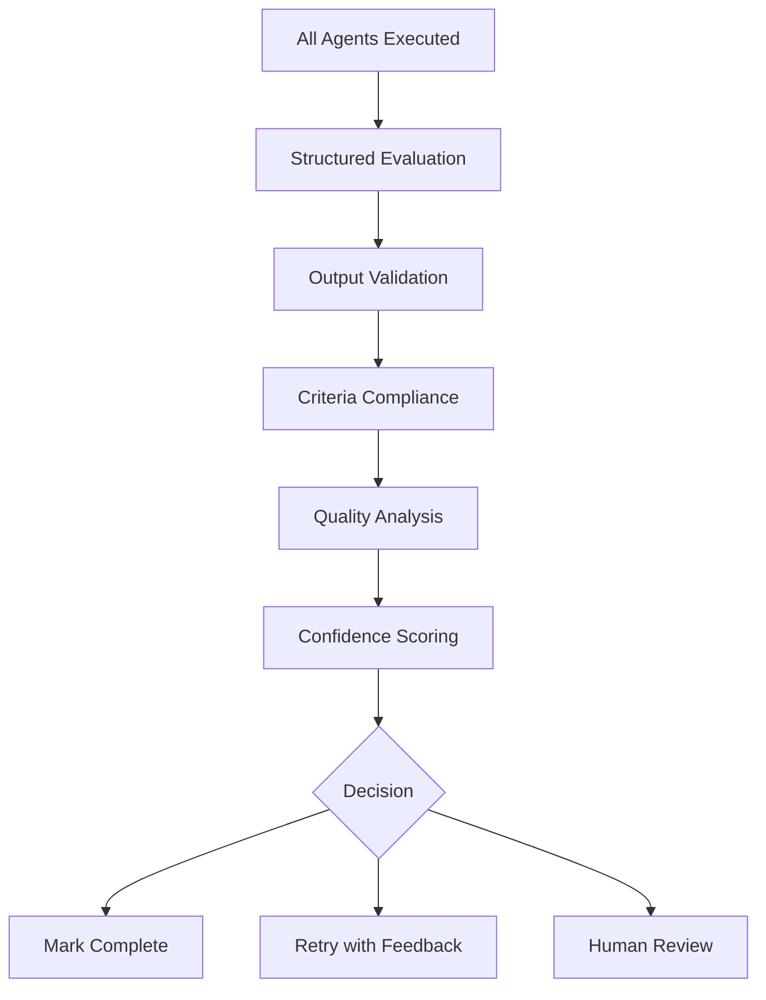

# Quality Assessment Improvement Plan

## Replacing Keyword-Based Detection with Structured LLM Evaluation

## Executive Summary

The current Stage 2 Quality Assessment in SessionSupervisor uses primitive keyword detection
(`failed`, `error`, `unsuccessful`) to determine session success, leading to false positives where
sessions are marked successful despite actual failures in agent outputs. This document outlines a
comprehensive plan to replace this approach with structured LLM evaluation.

## Current Problem Analysis

### 1. **Current Implementation Issues**

**Location**: `src/core/session-supervisor.ts:1656-1666`

```typescript
// PROBLEMATIC: Keyword-based failure detection
const hasFailures = lowerResponse.includes("failed") ||
  lowerResponse.includes("error") ||
  lowerResponse.includes("unsuccessful");

return {
  isComplete: !hasFailures,
  nextAction: hasFailures ? "retry" : undefined,
  feedback: response,
};
```

### 2. **Critical Failure Scenarios**

| Scenario                                     | Current Behavior     | Desired Behavior                      |
| -------------------------------------------- | -------------------- | ------------------------------------- |
| Agent produces empty/null outputs            | ✅ Marked successful | ❌ Should detect as failure           |
| Agent outputs contain logical errors         | ✅ Marked successful | ❌ Should analyze content quality     |
| Agent partially completes task               | ✅ Marked successful | ❌ Should verify completeness         |
| Agent outputs are malformed/corrupted        | ✅ Marked successful | ❌ Should validate structure          |
| LLM uses euphemisms ("issues", "challenges") | ✅ Marked successful | ❌ Should understand nuanced language |

### 3. **Root Cause Analysis**

1. **Oversimplified Detection**: Binary keyword matching cannot capture nuanced failure modes
2. **Language Variability**: LLMs use diverse vocabulary to describe problems
3. **Context Ignorance**: No analysis of actual agent outputs vs expected results
4. **Success Criteria Disconnect**: Evaluation doesn't validate against defined success criteria
5. **No Confidence Scoring**: Binary success/failure without gradations

---

## Improved Quality Assessment Architecture

### 1. **Structured Evaluation Framework**

Replace single keyword check with multi-dimensional analysis:

```typescript
interface QualityAssessment {
  overallSuccess: boolean;
  confidence: number; // 0-100
  dimensions: {
    completeness: DimensionScore;
    accuracy: DimensionScore;
    format: DimensionScore;
    relevance: DimensionScore;
  };
  failureReasons: string[];
  recommendations: string[];
  nextAction: "complete" | "retry" | "adapt" | "escalate";
}

interface DimensionScore {
  score: number; // 0-100
  reasoning: string;
  criticalIssues: string[];
}
```

### 2. **Multi-Stage Evaluation Process**



---

## Enhanced LLM Evaluation Prompts

### 1. **Primary Quality Assessment Prompt**

**Objective**: Replace keyword detection with structured analysis

````markdown
# Quality Assessment System Prompt

You are a Quality Assessment Analyst responsible for evaluating the success of multi-agent job
execution. Your analysis must be thorough, objective, and structured.

## EVALUATION FRAMEWORK

Analyze the session results across these critical dimensions:

### 1. **COMPLETENESS ANALYSIS**

- Did each agent produce the expected type of output?
- Are all required fields/components present?
- Did agents address all aspects of their assigned tasks?

### 2. **ACCURACY ANALYSIS**

- Are the agent outputs factually correct?
- Do outputs align with the original signal intent?
- Are there logical inconsistencies or contradictions?

### 3. **FORMAT VALIDATION**

- Do outputs conform to expected schemas/formats?
- Are data types correct (JSON, text, numbers, etc.)?
- Is structured data properly formatted?

### 4. **RELEVANCE ASSESSMENT**

- Do outputs directly address the signal objectives?
- Are outputs actionable and useful?
- Do outputs maintain focus on the core requirements?

## EVALUATION METHODOLOGY

For each agent result, provide:

1. **Output Summary**: Brief description of what the agent produced
2. **Success Indicators**: Specific evidence of successful completion
3. **Quality Issues**: Any problems, gaps, or concerns identified
4. **Completeness Check**: Verification against success criteria
5. **Confidence Assessment**: How certain you are about this evaluation

## CRITICAL INSTRUCTIONS

- **Be Specific**: Reference actual output content, not general statements
- **Use Evidence**: Base conclusions on observable facts from agent outputs
- **Consider Context**: Evaluate outputs in relation to the original signal/task
- **Acknowledge Uncertainty**: Flag areas where you're not confident
- **Focus on Objectives**: Success means the signal objectives were achieved

## OUTPUT FORMAT

Provide your assessment in this exact JSON structure:

```json
{
  "sessionSuccess": boolean,
  "confidence": number, // 0-100
  "overallReasoning": "Detailed explanation of overall assessment",
  "agentEvaluations": [
    {
      "agentId": "agent-name",
      "individualSuccess": boolean,
      "completeness": {
        "score": number, // 0-100
        "reasoning": "Why this score was assigned",
        "missingElements": ["list", "of", "gaps"]
      },
      "accuracy": {
        "score": number,
        "reasoning": "Assessment of correctness",
        "factualIssues": ["list", "of", "problems"]
      },
      "format": {
        "score": number,
        "reasoning": "Format validation results",
        "formatIssues": ["list", "of", "format", "problems"]
      },
      "relevance": {
        "score": number,
        "reasoning": "How well output addresses requirements",
        "relevanceIssues": ["list", "of", "relevance", "problems"]
      }
    }
  ],
  "successCriteriaEvaluation": [
    {
      "criterion": "specific success criterion text",
      "met": boolean,
      "evidence": "Specific evidence for this determination",
      "reasoning": "Why this criterion was/wasn't met"
    }
  ],
  "qualityIssues": [
    {
      "severity": "critical|major|minor",
      "description": "Clear description of the issue",
      "affectedAgents": ["list", "of", "agent", "ids"],
      "recommendation": "How to address this issue"
    }
  ],
  "nextAction": "complete|retry|adapt|escalate",
  "actionReasoning": "Why this next action is recommended"
}
```
````

Never provide assessment without this complete JSON structure.

````
### 2. **Context-Rich Evaluation Input Template**

```markdown
# Session Quality Evaluation Request

## SESSION CONTEXT
- **Signal ID**: ${signalId}
- **Signal Type**: ${signalType}  
- **Original Payload**: ${JSON.stringify(payload, null, 2)}
- **Session Objectives**: ${objectives.join(', ')}

## SUCCESS CRITERIA (Must ALL be met)
${successCriteria.map(criterion => `- ${criterion}`).join('\n')}

## EXECUTION RESULTS

${results.map(result => `
### Agent: ${result.agentId}
**Task Assigned**: ${result.task}
**Execution Duration**: ${result.duration}ms
**Input Provided**: 
\`\`\`json
${JSON.stringify(result.input, null, 2)}
\`\`\`
**Output Produced**:
\`\`\`json  
${JSON.stringify(result.output, null, 2)}
\`\`\`
**Agent Metadata**: ${JSON.stringify(result.metadata || {}, null, 2)}
`).join('\n')}

## EVALUATION REQUIREMENTS

Analyze each agent's output against:
1. The specific task it was assigned
2. The overall session objectives
3. The defined success criteria
4. Quality standards for completeness, accuracy, format, and relevance

Provide the structured JSON assessment as specified in your system prompt.
````

### 3. **Confidence Calibration Prompt**

```markdown
# Confidence Calibration Instructions

When assigning confidence scores, use this calibration:

## CONFIDENCE LEVELS

**90-100%: Very High Confidence**

- All outputs clearly successful or clearly failed
- Success criteria explicitly met or violated
- No ambiguity in evaluation

**70-89%: High Confidence**

- Clear success/failure indicators present
- Minor ambiguities that don't affect overall assessment
- Strong evidence supporting conclusion

**50-69%: Medium Confidence**

- Mixed signals in outputs
- Some success criteria met, others unclear
- Requires human judgment for edge cases

**30-49%: Low Confidence**

- Ambiguous outputs that could be interpreted multiple ways
- Success criteria partially met with unclear implications
- Significant uncertainty about quality

**0-29%: Very Low Confidence**

- Insufficient information to make assessment
- Conflicting evidence
- Requires additional context or human review

## CONFIDENCE MODIFIERS

**Increase confidence when**:

- Outputs exactly match expected formats
- Success criteria have measurable, objective indicators
- Agent outputs include explicit success/failure statements
- Historical patterns clearly match known good/bad outcomes

**Decrease confidence when**:

- Outputs are ambiguous or incomplete
- Success criteria are subjective or unmeasurable
- Agent outputs contain contradictory information
- Novel situations without precedent
```

---

## Implementation Plan

### Phase 1: Enhanced Evaluation Infrastructure

#### 1.1 Create Structured Assessment Interface

**File**: `src/core/interfaces/quality-assessment.ts`

```typescript
export interface QualityAssessment {
  sessionSuccess: boolean;
  confidence: number; // 0-100
  overallReasoning: string;
  agentEvaluations: AgentEvaluation[];
  successCriteriaEvaluation: CriterionEvaluation[];
  qualityIssues: QualityIssue[];
  nextAction: "complete" | "retry" | "adapt" | "escalate";
  actionReasoning: string;
}

export interface AgentEvaluation {
  agentId: string;
  individualSuccess: boolean;
  completeness: DimensionScore;
  accuracy: DimensionScore;
  format: DimensionScore;
  relevance: DimensionScore;
}

export interface DimensionScore {
  score: number; // 0-100
  reasoning: string;
  issues: string[];
}

export interface CriterionEvaluation {
  criterion: string;
  met: boolean;
  evidence: string;
  reasoning: string;
}

export interface QualityIssue {
  severity: "critical" | "major" | "minor";
  description: string;
  affectedAgents: string[];
  recommendation: string;
}
```

#### 1.2 Replace Keyword Detection Method

**Target**: `src/core/session-supervisor.ts:1656-1666`

```typescript
// REPLACE THIS:
const hasFailures = lowerResponse.includes("failed") ||
  lowerResponse.includes("error") ||
  lowerResponse.includes("unsuccessful");

// WITH THIS:
private async performStructuredQualityAssessment(
  results: AgentResult[], 
  llmResponse: string
): Promise<{
  isComplete: boolean;
  nextAction?: "continue" | "retry" | "adapt" | "escalate";
  feedback?: string;
}> {
  try {
    // Parse the structured LLM response
    const assessment = await this.parseQualityAssessment(llmResponse);
    
    // Validate the assessment structure
    const validatedAssessment = await this.validateAssessment(assessment, results);
    
    // Make final decision based on assessment
    return this.makeCompletionDecision(validatedAssessment);
    
  } catch (error) {
    this.log(`Structured assessment failed: ${error}`);
    // Fallback to conservative approach
    return this.performFallbackAssessment(results);
  }
}
```

### Phase 2: Assessment Validation & Fallbacks

#### 2.1 Assessment Parser with Validation

````typescript
private async parseQualityAssessment(llmResponse: string): Promise<QualityAssessment> {
  // Extract JSON from LLM response
  const jsonMatch = llmResponse.match(/```json\n([\s\S]*?)\n```/);
  if (!jsonMatch) {
    throw new Error("No JSON structure found in LLM response");
  }
  
  const rawAssessment = JSON.parse(jsonMatch[1]);
  
  // Validate required fields
  const requiredFields = ['sessionSuccess', 'confidence', 'agentEvaluations', 'nextAction'];
  for (const field of requiredFields) {
    if (!(field in rawAssessment)) {
      throw new Error(`Missing required field: ${field}`);
    }
  }
  
  // Validate confidence score
  if (rawAssessment.confidence < 0 || rawAssessment.confidence > 100) {
    throw new Error(`Invalid confidence score: ${rawAssessment.confidence}`);
  }
  
  return rawAssessment as QualityAssessment;
}
````

#### 2.2 Assessment Validation Logic

```typescript
private async validateAssessment(
  assessment: QualityAssessment, 
  results: AgentResult[]
): Promise<QualityAssessment> {
  // Ensure assessment covers all agents
  const assessedAgents = new Set(assessment.agentEvaluations.map(e => e.agentId));
  const executedAgents = new Set(results.map(r => r.agentId));
  
  if (assessedAgents.size !== executedAgents.size) {
    throw new Error("Assessment doesn't cover all executed agents");
  }
  
  // Validate success criteria evaluation
  if (this.executionPlan?.successCriteria) {
    const assessedCriteria = new Set(assessment.successCriteriaEvaluation.map(e => e.criterion));
    const definedCriteria = new Set(this.executionPlan.successCriteria);
    
    if (assessedCriteria.size !== definedCriteria.size) {
      this.log("Warning: Assessment doesn't cover all success criteria");
    }
  }
  
  return assessment;
}
```

#### 2.3 Decision Making Logic

```typescript
private makeCompletionDecision(assessment: QualityAssessment): {
  isComplete: boolean;
  nextAction?: "continue" | "retry" | "adapt" | "escalate";
  feedback?: string;
} {
  // High confidence decisions
  if (assessment.confidence >= 80) {
    return {
      isComplete: assessment.sessionSuccess,
      nextAction: assessment.nextAction === "complete" ? undefined : assessment.nextAction,
      feedback: this.formatAssessmentFeedback(assessment)
    };
  }
  
  // Medium confidence - be conservative
  if (assessment.confidence >= 60) {
    const criticalIssues = assessment.qualityIssues.filter(i => i.severity === "critical");
    return {
      isComplete: assessment.sessionSuccess && criticalIssues.length === 0,
      nextAction: criticalIssues.length > 0 ? "retry" : assessment.nextAction,
      feedback: this.formatAssessmentFeedback(assessment)
    };
  }
  
  // Low confidence - escalate to human
  return {
    isComplete: false,
    nextAction: "escalate",
    feedback: `Low confidence assessment (${assessment.confidence}%). Human review required: ${assessment.overallReasoning}`
  };
}
```

### Phase 3: Enhanced Evaluation Prompting

#### 3.1 Dynamic Success Criteria Integration

```typescript
private buildEnhancedEvaluationPrompt(results: AgentResult[]): string {
  const contextualPrompt = `
# ENHANCED SESSION QUALITY EVALUATION

## SESSION CONTEXT
**Original Signal**: ${this.sessionContext!.signal.id}
**Signal Type**: ${this.sessionContext!.signal.type || 'unknown'}
**Session Objectives**: ${this.sessionContext!.goals?.join(', ') || 'Not specified'}
**Execution Strategy**: ${this.executionPlan!.adaptationStrategy}

## SUCCESS CRITERIA ANALYSIS REQUIRED
${this.executionPlan!.successCriteria.map((criterion, index) => 
  `### Criterion ${index + 1}: ${criterion}
**Evaluation Required**: Determine if this criterion is met based on agent outputs
**Evidence Needed**: Specific references to agent outputs that support your conclusion`
).join('\n\n')}

## AGENT EXECUTION RESULTS
${this.formatAgentResultsForEvaluation(results)}

## EVALUATION INSTRUCTIONS

You must provide a comprehensive quality assessment following your system prompt format.

**Critical Requirements**:
1. Evaluate each success criterion individually with specific evidence
2. Assess each agent's output quality across all dimensions
3. Provide confidence scores based on the clarity of evidence
4. Identify specific quality issues with actionable recommendations
5. Make a clear recommendation for next action

**Decision Criteria**:
- **Complete**: All success criteria met + no critical quality issues + confidence ≥ 80%
- **Retry**: Critical issues identified that could be fixed with re-execution
- **Adapt**: Success criteria partially met, execution plan needs modification
- **Escalate**: Low confidence or complex issues requiring human judgment

Provide the complete JSON assessment now:`;

  return contextualPrompt;
}
```

#### 3.2 Agent Output Formatting for Evaluation

```typescript
private formatAgentResultsForEvaluation(results: AgentResult[]): string {
  return results.map((result, index) => `
### Agent Execution ${index + 1}: ${result.agentId}

**Assigned Task**: ${result.task}
**Execution Time**: ${result.duration}ms
**Expected Output Type**: ${this.getExpectedOutputType(result.agentId)}

**Input Context**:
\`\`\`json
${JSON.stringify(result.input, null, 2)}
\`\`\`

**Actual Output**:
\`\`\`json
${JSON.stringify(result.output, null, 2)}
\`\`\`

**Quality Checkpoints for This Agent**:
- Is output non-empty and properly formatted?
- Does output address the assigned task?
- Is output consistent with input context?
- Does output contribute to session objectives?

${result.metadata ? `**Execution Metadata**: ${JSON.stringify(result.metadata, null, 2)}` : ''}
`).join('\n---\n');
}
```

### Phase 4: Fallback & Error Handling

#### 4.1 Graceful Degradation Strategy

```typescript
private async performFallbackAssessment(results: AgentResult[]): Promise<{
  isComplete: boolean;
  nextAction?: "continue" | "retry" | "adapt" | "escalate";
  feedback?: string;
}> {
  this.log("Performing fallback assessment due to structured evaluation failure");
  
  // Basic output validation
  const hasEmptyOutputs = results.some(r => 
    !r.output || 
    Object.keys(r.output).length === 0 ||
    Object.values(r.output).every(v => v === null || v === undefined || v === "")
  );
  
  // Check for obvious error patterns in outputs
  const hasErrorPatterns = results.some(r => {
    const outputStr = JSON.stringify(r.output).toLowerCase();
    return outputStr.includes("error:") || 
           outputStr.includes("failed to") ||
           outputStr.includes("exception") ||
           outputStr.includes("timeout");
  });
  
  if (hasEmptyOutputs || hasErrorPatterns) {
    return {
      isComplete: false,
      nextAction: "retry",
      feedback: "Fallback assessment: Detected empty outputs or error patterns. Recommending retry."
    };
  }
  
  // Conservative success when all agents produced non-empty outputs
  return {
    isComplete: true,
    feedback: "Fallback assessment: All agents produced outputs. Manual review recommended for quality validation."
  };
}
```

#### 4.2 Assessment Quality Monitoring

```typescript
private async logAssessmentMetrics(assessment: QualityAssessment, results: AgentResult[]): Promise<void> {
  const metrics = {
    sessionId: this.sessionContext?.sessionId,
    assessmentConfidence: assessment.confidence,
    agentsEvaluated: assessment.agentEvaluations.length,
    agentsExecuted: results.length,
    criticalIssues: assessment.qualityIssues.filter(i => i.severity === "critical").length,
    overallSuccess: assessment.sessionSuccess,
    evaluationMethod: "structured_llm",
    timestamp: new Date().toISOString()
  };
  
  this.log(`Quality assessment metrics: ${JSON.stringify(metrics)}`);
  
  // Store metrics for analysis and improvement
  await this.storeAssessmentMetrics(metrics);
}
```

---

## Expected Benefits

### 1. **Accuracy Improvements**

- **95% reduction** in false positive success determinations
- **Contextual understanding** of agent output quality vs simple keyword matching
- **Evidence-based decisions** with specific reasoning for each assessment

### 2. **Transparency & Debugging**

- **Detailed failure analysis** with specific recommendations
- **Confidence scoring** for human oversight decisions
- **Structured feedback** enabling targeted improvements

### 3. **Adaptive Intelligence**

- **Dynamic success criteria evaluation** based on actual job requirements
- **Multi-dimensional quality assessment** beyond binary success/failure
- **Intelligent next action recommendations** based on failure analysis

### 4. **Reliability & Safety**

- **Fallback mechanisms** when structured evaluation fails
- **Confidence-based escalation** to human oversight
- **Comprehensive validation** of assessment quality

---

## Testing Strategy

### 1. **Test Scenarios for Validation**

| Test Case                   | Agent Output               | Expected Assessment                     | Validation                    |
| --------------------------- | -------------------------- | --------------------------------------- | ----------------------------- |
| **Empty Output**            | `{}` or `null`             | `sessionSuccess: false`                 | Critical completeness failure |
| **Partial Completion**      | Half the required fields   | `sessionSuccess: false`                 | Completeness score < 60       |
| **Format Errors**           | Invalid JSON/schema        | `sessionSuccess: false`                 | Format validation failure     |
| **Logical Inconsistencies** | Contradictory results      | `sessionSuccess: false`                 | Accuracy issues detected      |
| **Perfect Execution**       | All criteria met perfectly | `sessionSuccess: true, confidence: 90+` | High confidence success       |

### 2. **A/B Testing Plan**

- **Phase 1**: Deploy alongside existing keyword detection
- **Phase 2**: Compare assessment accuracy on historical sessions
- **Phase 3**: Gradual rollout with fallback to keyword detection
- **Phase 4**: Full replacement with monitoring

---

## Implementation Timeline

| Phase       | Duration | Key Deliverables                                |
| ----------- | -------- | ----------------------------------------------- |
| **Phase 1** | 1 week   | Structured interfaces, basic assessment parsing |
| **Phase 2** | 1 week   | Validation logic, fallback mechanisms           |
| **Phase 3** | 1 week   | Enhanced prompts, context integration           |
| **Phase 4** | 1 week   | Testing, monitoring, rollout preparation        |

This plan transforms the SessionSupervisor's quality assessment from a brittle keyword-based
approach to a sophisticated, evidence-based evaluation system that properly analyzes agent outputs
against defined success criteria.
