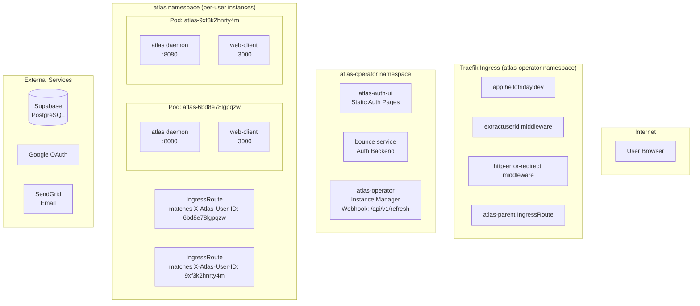
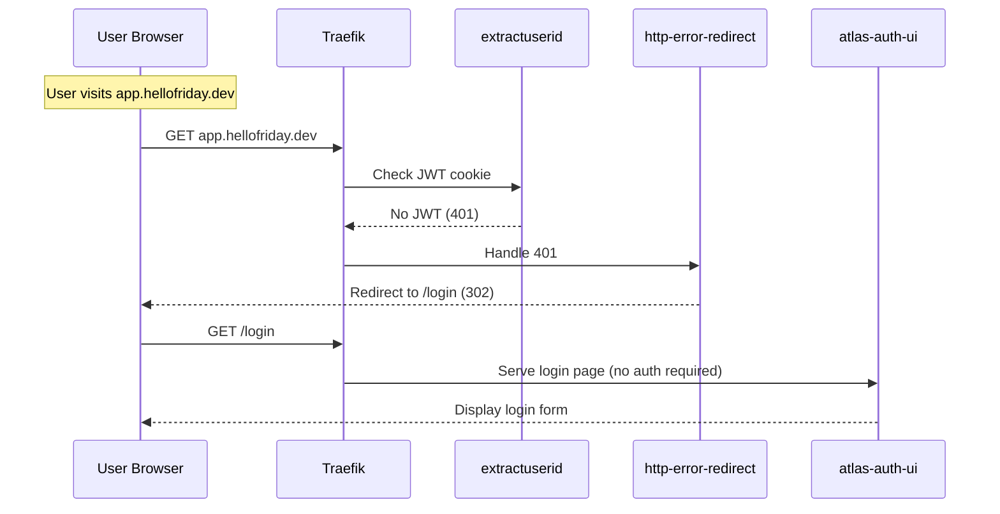
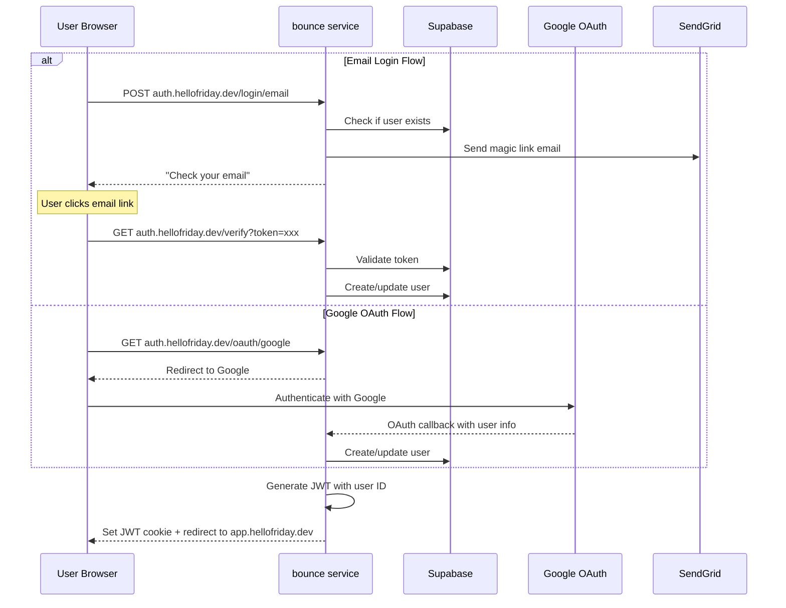
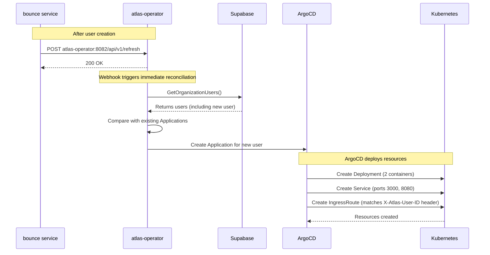
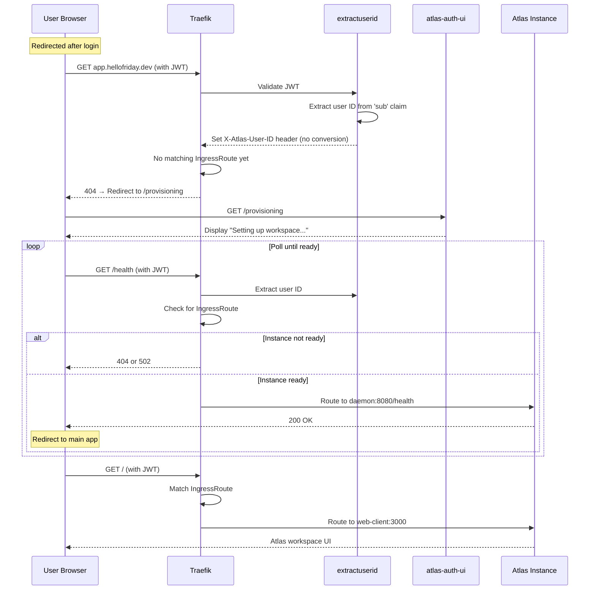
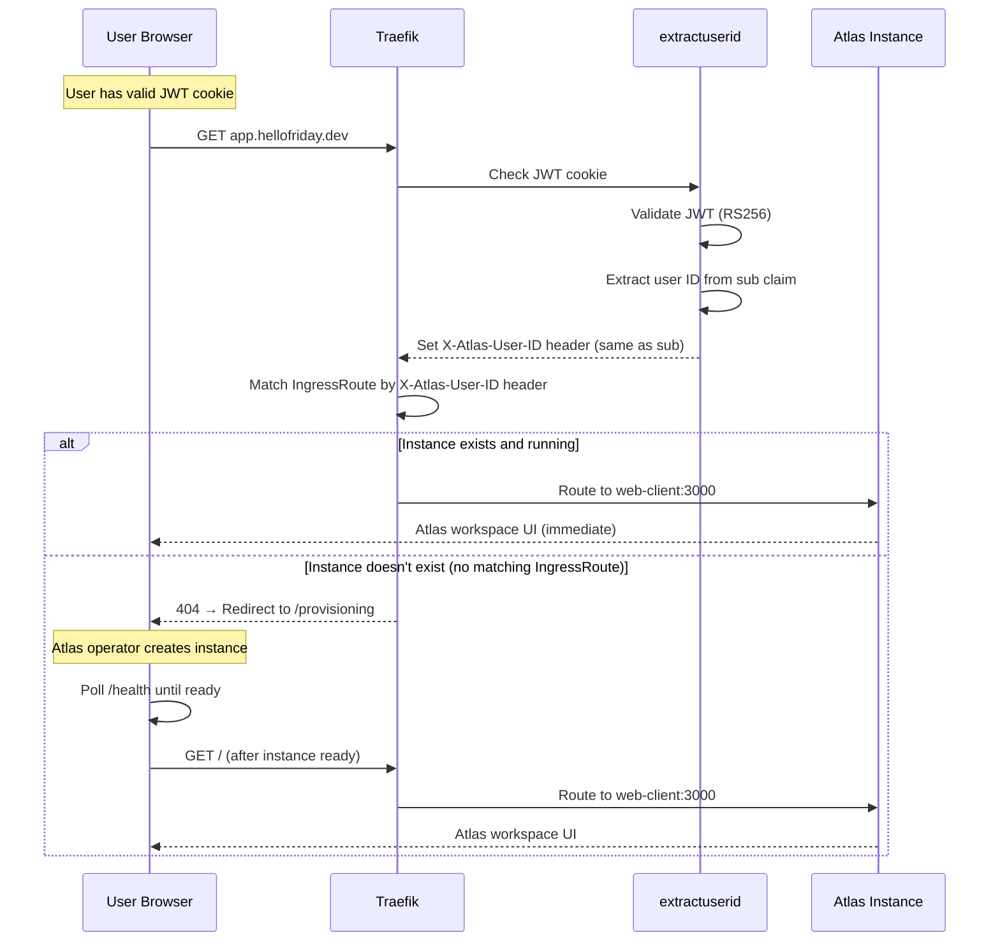
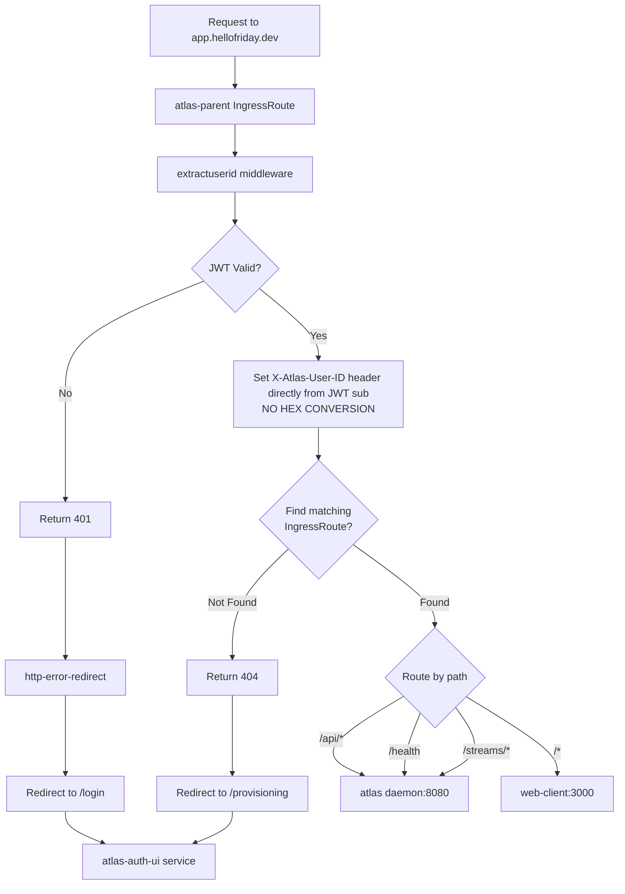
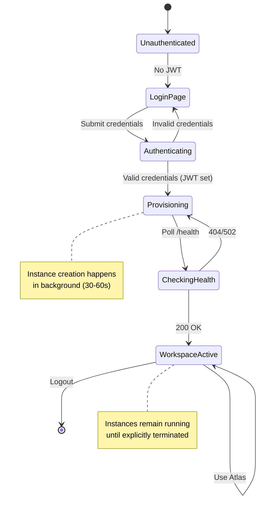
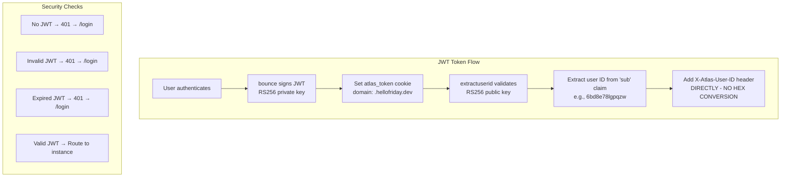
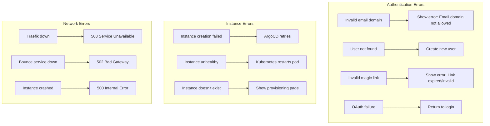

# Atlas Authentication User Journey

## Architecture Overview

## First-Time User Journey (Unauthenticated)

### Phase 1: Initial Access & Redirect to Login

### Phase 2: Authentication

### Phase 3: Instance Provisioning

### Phase 4: Waiting for Instance & Access

## Returning User Journey (Authenticated)

## Key Components

### 1. **Traefik Ingress** (atlas-operator namespace)
- **extractuserid middleware** (forked to Atlas): Validates JWT, extracts user ID from 'sub' claim, sets X-Atlas-User-ID header, returns 401 if invalid
  - Example: User ID `6bd8e78lgpqzw` (base36, lowercase+digits only)
  - **NO HEX CONVERSION** - ID used directly in header from JWT 'sub' claim
- **http-error-redirect middleware**: Catches 401, redirects to /login
- **atlas-parent IngressRoute**: Parent route that applies middleware
- **Per-user IngressRoutes** (in atlas namespace): Match on X-Atlas-User-ID header value
  - Example: `Header(\`X-Atlas-User-ID\`, \`6bd8e78lgpqzw\`)`
  - Routes to service `atlas-6bd8e78lgpqzw`

### 2. **atlas-auth-ui** (atlas-operator namespace)
- Always-available static site
- Serves: `/login`, `/signup`, `/verify`, `/complete-setup`, `/provisioning`
- No authentication required (except /provisioning needs JWT to know which user)

### 3. **bounce service** (atlas-operator namespace)
- Handles authentication logic
- Creates users in Supabase database
- Issues JWT tokens (RS256)
- **Triggers instance creation** via webhook to atlas-operator `/api/v1/refresh`
  - Ensures immediate provisioning instead of waiting for next poll cycle

### 4. **atlas-operator** (atlas-operator namespace)
- **Polls database periodically** (ReconciliationInterval, e.g., every 30s)
- **Webhook endpoint** (`/api/v1/refresh`) for immediate reconciliation
  - Called by bounce after user creation to trigger instant provisioning
  - Authenticated via HMAC signature
- Queries for users in database
- **Automatically creates ArgoCD Applications** for new users found in DB
- ArgoCD then deploys the Atlas instance resources
- Also removes Applications when users are deleted from DB

### 5. **Atlas Instances** (atlas namespace)
- Per-user pods with 2 containers:
  - **atlas daemon** (port 8080): Handles /api/*, /health, /streams/*
  - **web-client** (port 3000): Serves the UI
- Service: `atlas-{userID}` (e.g., `atlas-6bd8e78lgpqzw`) exposing both ports
- IngressRoute: Matches `X-Atlas-User-ID` header, routes by path

## Request Flow Rules

## State Transitions

## Security Flow

## Error Handling Flows

## Summary

### First-Time User Flow
1. **Redirected to login** (no JWT)
2. **Authenticate** via email/OAuth
3. **User created** in Supabase
4. **Bounce calls webhook** to trigger immediate reconciliation
5. **JWT issued** as cookie
6. **Provisioning page** shown while instance is created
7. **Instance ready** → Access workspace

### Returning User Flow
1. **JWT validated** by extractuserid
2. **User ID extracted** and set as header
3. **IngressRoute matched** by header
4. **Routed directly** to existing instance

### Key Security Features
- RS256 JWT signing
- HTTPOnly secure cookies
- Domain-locked cookies (`.hellofriday.dev`)
- No JWT = automatic redirect to login
- User ID extraction prevents header injection
- Per-user isolated instances