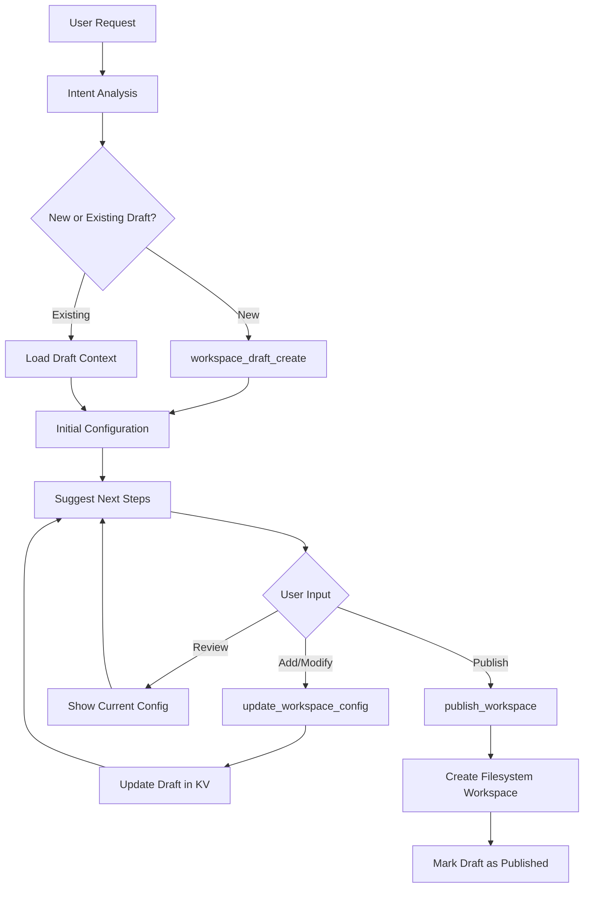

# Conversation Supervisor Workspace Creation Enhancement Plan V2

## Overview

This document outlines an iterative, draft-based approach to enhance the Atlas conversation
supervisor's workspace creation capabilities. Instead of creating workspaces in a single operation,
this approach uses Deno KV to maintain draft workspaces that can be iteratively refined through
natural conversation before being published to the filesystem.

## Key Innovation: Draft-Based Workflow

The core insight is that workspace creation is inherently an iterative process. By maintaining
drafts in Deno KV, we enable:

1. **Natural Conversation Flow**: Users can refine their workspace design through multiple exchanges
2. **Safe Experimentation**: Changes are isolated in KV until explicitly published
3. **Preview Capabilities**: Users can see the full configuration before committing
4. **Abandonment Without Side Effects**: Drafts can be discarded without filesystem artifacts

## Architecture Design

### 1. Three-Tool Approach

Instead of a single complex tool, we decompose workspace creation into three focused tools:

```typescript
// 1. Create a draft workspace
workspace_draft_create: {
  name: string;
  description: string;
  pattern?: "pipeline" | "ensemble" | "hierarchy" | "custom";
}

// 2. Update draft configuration
update_workspace_config: {
  draftId: string;
  operation: "add_agent" | "update_agent" | "add_job" | "update_job" | "set_trigger" | "add_tool";
  config: Record<string, unknown>;
}

// 3. Publish draft to filesystem
publish_workspace: {
  draftId: string;
  path?: string;
}
```

### 2. Deno KV Schema

```typescript
import type {
  JobSpecification,
  ToolsConfig,
  WorkspaceAgentConfig,
  WorkspaceConfig,
  WorkspaceSignalConfig,
} from "@atlas/config";

interface WorkspaceDraft {
  id: string;
  name: string;
  description: string;
  config: Partial<WorkspaceConfig>; // Use the existing WorkspaceConfig type
  iterations: Array<{
    timestamp: string;
    operation: string;
    config: Record<string, unknown>;
    summary: string;
  }>;
  createdAt: string;
  updatedAt: string;
  status: "draft" | "published" | "abandoned";
  sessionId: string;
  userId: string;
}
```

### 3. Conversation Flow



## Implementation Plan

### Phase 1: Deno KV Integration

Create KV utilities for draft management:

```typescript
// src/services/workspace-draft-store.ts
import type {
  AgentDesignSchema,
  JobSpecification,
  WorkspaceAgentConfig,
  WorkspaceConfig,
  WorkspaceSignalConfig,
} from "@atlas/config";
import { z } from "zod/v4";

export class WorkspaceDraftStore {
  private kv: Deno.Kv;

  constructor(kv: Deno.Kv) {
    this.kv = kv;
  }

  async createDraft(params: {
    name: string;
    description: string;
    pattern?: string;
    sessionId: string;
    userId: string;
  }): Promise<WorkspaceDraft> {
    const draft: WorkspaceDraft = {
      id: crypto.randomUUID(),
      name: params.name,
      description: params.description,
      config: this.getInitialConfig(
        params.name,
        params.description,
        params.pattern,
      ),
      iterations: [],
      createdAt: new Date().toISOString(),
      updatedAt: new Date().toISOString(),
      status: "draft",
      sessionId: params.sessionId,
      userId: params.userId,
    };

    const key = ["workspace_drafts", draft.id];
    await this.kv.set(key, draft);

    // Also index by session for easy retrieval
    const sessionKey = [
      "workspace_drafts_by_session",
      params.sessionId,
      draft.id,
    ];
    await this.kv.set(sessionKey, draft.id);

    return draft;
  }

  async updateDraft(
    draftId: string,
    operation: string,
    config: Record<string, unknown>,
  ): Promise<WorkspaceDraft> {
    const key = ["workspace_drafts", draftId];
    const entry = await this.kv.get<WorkspaceDraft>(key);

    if (!entry.value) {
      throw new Error(`Draft ${draftId} not found`);
    }

    const draft = entry.value;

    // Apply the update based on operation type
    this.applyOperation(draft, operation, config);

    // Add to iteration history
    draft.iterations.push({
      timestamp: new Date().toISOString(),
      operation,
      config,
      summary: this.generateOperationSummary(operation, config),
    });

    draft.updatedAt = new Date().toISOString();

    await this.kv.set(key, draft);
    return draft;
  }

  private applyOperation(
    draft: WorkspaceDraft,
    operation: string,
    config: Record<string, unknown>,
  ): void {
    switch (operation) {
      case "add_agent":
        // Ensure agents object exists
        if (!draft.config.agents) draft.config.agents = {};

        // Create agent config using WorkspaceAgentConfig type
        const agentConfig: WorkspaceAgentConfig = {
          type: (config.type as "llm" | "tempest" | "remote") || "llm",
          model: (config.model as string) || "claude-3-5-haiku-20241022",
          purpose: config.purpose as string,
          ...(config.system_prompt && {
            prompts: { system: config.system_prompt as string },
          }),
          ...(config.tools && { tools: { mcp: config.tools as string[] } }),
        };

        draft.config.agents[config.id as string] = agentConfig;
        break;

      case "update_agent":
        if (draft.config.agents[config.id as string]) {
          Object.assign(
            draft.config.agents[config.id as string],
            config.updates,
          );
        }
        break;

      case "add_job":
        // Ensure jobs object exists
        if (!draft.config.jobs) draft.config.jobs = {};

        // Create job config using JobSpecification type
        const jobConfig: JobSpecification = {
          name: config.id as string,
          description: config.description as string,
          triggers: (config.triggers as any) || [
            { signal: `${draft.name}-trigger` },
          ],
          execution: config.execution as any,
        };

        draft.config.jobs[config.id as string] = jobConfig;
        break;

      case "set_trigger":
        // Ensure signals object exists
        if (!draft.config.signals) draft.config.signals = {};

        const signalId = `${draft.name}-trigger`;
        // Create signal config using WorkspaceSignalConfig type
        const signalConfig: WorkspaceSignalConfig = {
          description: (config.description as string) || `Trigger for ${draft.name}`,
          provider: config.provider as string,
          ...(config.providerConfig as Record<string, any>),
        };

        draft.config.signals[signalId] = signalConfig;
        break;

      case "add_tool":
        if (!draft.config.tools) draft.config.tools = {};
        draft.config.tools[config.provider as string] = config.config;
        break;
    }
  }

  private getInitialConfig(
    name: string,
    description: string,
    pattern?: string,
  ): Partial<WorkspaceConfig> {
    // Return minimal config based on pattern using proper types
    const config: Partial<WorkspaceConfig> = {
      version: "1.0",
      workspace: {
        name,
        description: description || "",
      },
      signals: {},
      jobs: {},
      agents: {},
    };

    // Add pattern-specific defaults
    if (pattern === "pipeline") {
      config.signals![`${name}-trigger`] = {
        description: `Start the ${name} pipeline`,
        provider: "cli",
      };
    }

    return config;
  }

  async publishDraft(draftId: string): Promise<void> {
    const key = ["workspace_drafts", draftId];
    const entry = await this.kv.get<WorkspaceDraft>(key);

    if (!entry.value) {
      throw new Error(`Draft ${draftId} not found`);
    }

    const draft = entry.value;
    draft.status = "published";
    draft.updatedAt = new Date().toISOString();

    await this.kv.set(key, draft);
  }

  async getSessionDrafts(sessionId: string): Promise<WorkspaceDraft[]> {
    const drafts: WorkspaceDraft[] = [];
    const prefix = ["workspace_drafts_by_session", sessionId];

    for await (const entry of this.kv.list({ prefix })) {
      const draftId = entry.value as string;
      const draftEntry = await this.kv.get<WorkspaceDraft>([
        "workspace_drafts",
        draftId,
      ]);
      if (draftEntry.value && draftEntry.value.status === "draft") {
        drafts.push(draftEntry.value);
      }
    }

    return drafts;
  }
}
```

### Phase 2: Enhanced Conversation Tools

Update the conversation supervisor with the three new tools:

```typescript
// In conversation-supervisor.ts
import {
  JobSpecificationSchema,
  MCPToolNameSchema,
  WorkspaceAgentConfigSchema,
  WorkspaceConfigSchema,
} from "@atlas/config";

const workspaceTools: Record<string, Tool> = {
  workspace_draft_create: {
    description: "Create a new workspace draft that can be iteratively refined",
    parameters: z.object({
      name: MCPToolNameSchema.describe(
        "Workspace name (lowercase with hyphens, no dots)",
      ),
      description: z
        .string()
        .describe("Clear description of the workspace's purpose"),
      pattern: z
        .enum(["pipeline", "ensemble", "hierarchy", "custom"])
        .optional()
        .describe("Workspace pattern to use as starting template"),
    }),
    execute: async (
      { name, description, pattern },
      { sessionId, userId, atlasContext },
    ) => {
      const kv = await Deno.openKv();
      const store = new WorkspaceDraftStore(kv);

      try {
        const draft = await store.createDraft({
          name,
          description,
          pattern,
          sessionId,
          userId,
        });

        // Store current draft ID in session context
        atlasContext.currentDraftId = draft.id;

        return {
          success: true,
          draftId: draft.id,
          message: `Created draft workspace '${name}'. Now let's design the agents and workflow.`,
          suggestions: getPatternSuggestions(pattern),
        };
      } finally {
        kv.close();
      }
    },
  },

  update_workspace_config: {
    description: "Update the draft workspace configuration by adding or modifying components",
    parameters: z.object({
      draftId: z.uuid().describe("Draft workspace ID"),
      operation: z
        .enum([
          "add_agent",
          "update_agent",
          "remove_agent",
          "add_job",
          "update_job",
          "remove_job",
          "set_trigger",
          "add_tool",
          "remove_tool",
        ])
        .describe("Type of update operation"),
      config: z.record(z.unknown()).describe("Configuration for the operation"),
    }),
    execute: async ({ draftId, operation, config }, { atlasContext }) => {
      const kv = await Deno.openKv();
      const store = new WorkspaceDraftStore(kv);

      try {
        const draft = await store.updateDraft(draftId, operation, config);

        return {
          success: true,
          draftId: draft.id,
          operation,
          message: generateUpdateMessage(operation, config),
          currentAgents: Object.keys(draft.config.agents),
          currentJobs: Object.keys(draft.config.jobs),
          nextSteps: suggestNextSteps(draft),
        };
      } finally {
        kv.close();
      }
    },
  },

  publish_workspace: {
    description: "Publish a draft workspace to the filesystem, making it available for use",
    parameters: z.object({
      draftId: z.uuid().describe("Draft workspace ID to publish"),
      path: z
        .string()
        .optional()
        .describe("Optional path where workspace should be created"),
    }),
    execute: async ({ draftId, path }, { atlasContext }) => {
      const kv = await Deno.openKv();
      const store = new WorkspaceDraftStore(kv);

      try {
        const key = ["workspace_drafts", draftId];
        const entry = await kv.get<WorkspaceDraft>(key);

        if (!entry.value) {
          return {
            success: false,
            error: `Draft ${draftId} not found`,
          };
        }

        const draft = entry.value;

        // Validate the config before publishing
        const validationResult = WorkspaceConfigSchema.safeParse(draft.config);
        if (!validationResult.success) {
          return {
            success: false,
            error: `Configuration validation failed: ${validationResult.error.message}`,
            issues: validationResult.error.issues,
          };
        }

        // Generate YAML from validated config
        const yaml = dump(validationResult.data, { lineWidth: -1 });

        // Call daemon API to create workspace
        const response = await atlasContext.client.createWorkspaceFromConfig({
          name: draft.name,
          description: draft.description,
          config: yaml,
          path,
        });

        // Mark draft as published
        await store.publishDraft(draftId);

        return {
          success: true,
          workspaceId: response.id,
          path: response.path,
          message: `Successfully published workspace '${draft.name}'`,
          summary: {
            agents: Object.keys(draft.config.agents).length,
            jobs: Object.keys(draft.config.jobs).length,
            iterations: draft.iterations.length,
          },
        };
      } finally {
        kv.close();
      }
    },
  },

  show_draft_config: {
    description: "Display the current draft workspace configuration in YAML format",
    parameters: z.object({
      draftId: z.uuid().describe("Draft workspace ID"),
      format: z
        .enum(["yaml", "summary"])
        .default("summary")
        .describe("Output format"),
    }),
    execute: async ({ draftId, format }, { atlasContext }) => {
      const kv = await Deno.openKv();

      try {
        const key = ["workspace_drafts", draftId];
        const entry = await kv.get<WorkspaceDraft>(key);

        if (!entry.value) {
          return {
            success: false,
            error: `Draft ${draftId} not found`,
          };
        }

        const draft = entry.value;

        if (format === "yaml") {
          return {
            success: true,
            config: dump(draft.config, { lineWidth: -1 }),
            iterations: draft.iterations.length,
          };
        } else {
          return {
            success: true,
            summary: {
              name: draft.name,
              description: draft.description,
              agents: Object.entries(draft.config.agents).map(
                ([id, agent]: [string, any]) => ({
                  id,
                  purpose: agent.purpose,
                  type: agent.type,
                }),
              ),
              jobs: Object.entries(draft.config.jobs).map(
                ([id, job]: [string, any]) => ({
                  id,
                  description: job.description,
                  agentCount: job.execution?.agents?.length || 0,
                }),
              ),
              signals: Object.keys(draft.config.signals),
              tools: Object.keys(draft.config.tools || {}),
            },
          };
        }
      } finally {
        kv.close();
      }
    },
  },

  list_session_drafts: {
    description: "List all draft workspaces for the current session",
    parameters: z.object({}),
    execute: async (_, { sessionId }) => {
      const kv = await Deno.openKv();
      const store = new WorkspaceDraftStore(kv);

      try {
        const drafts = await store.getSessionDrafts(sessionId);

        return {
          success: true,
          drafts: drafts.map((d) => ({
            id: d.id,
            name: d.name,
            description: d.description,
            createdAt: d.createdAt,
            agentCount: Object.keys(d.config.agents).length,
            jobCount: Object.keys(d.config.jobs).length,
          })),
        };
      } finally {
        kv.close();
      }
    },
  },
};
```

### Phase 3: Enhanced System Prompt

Update the conversation supervisor's system prompt to understand the iterative workflow:

```typescript
const ENHANCED_SYSTEM_PROMPT = `
You are Addy, the Atlas AI assistant specialized in creating sophisticated multi-agent workspaces through iterative conversation.

## Workspace Creation Process

You now use a draft-based workflow that allows users to iteratively build their workspaces:

1. **Create Draft**: Start with workspace_draft_create to establish the foundation
2. **Iterative Refinement**: Use update_workspace_config to add agents, jobs, and other components
3. **Review**: Use show_draft_config to display the current configuration
4. **Publish**: Use publish_workspace to create the actual workspace

## Conversation Patterns

### Starting a New Workspace
User: "I want to create a data processing pipeline"
You: "I'll help you create a data processing pipeline workspace. Let me start by creating a draft."
[Use workspace_draft_create with pattern="pipeline"]
"I've created a draft workspace. Now, let's define the agents. What stages should your pipeline have?"

### Adding Agents Iteratively
User: "I need an agent to fetch data from an API"
You: "I'll add an API fetcher agent to your workspace."
[Use update_workspace_config with operation="add_agent"]
"Added the api-fetcher agent. What should happen to the data after it's fetched?"

### Reviewing Progress
User: "Show me what we have so far"
You: "Let me show you the current configuration."
[Use show_draft_config]
"Here's your workspace so far: [summary]. What would you like to add or modify next?"

### Publishing
User: "This looks good, let's create it"
You: "I'll publish your workspace now."
[Use publish_workspace]
"Your workspace has been created successfully! You can now trigger it using [trigger details]."

## Key Principles

1. **Guide Through Questions**: Ask clarifying questions to understand requirements
2. **Incremental Building**: Add one component at a time for clarity
3. **Confirm Understanding**: Summarize what you're adding before each update
4. **Suggest Next Steps**: After each update, suggest logical next components
5. **Maintain Context**: Reference the current draft state in your responses

## Common Patterns to Suggest

Based on the workspace type, proactively suggest:

### Pipeline Pattern
- Sequential agents with input_source: "previous"
- Clear data transformation at each stage
- Error handling agents

### Ensemble Pattern  
- Multiple agents with input_source: "signal"
- Aggregator agent to combine results
- Parallel execution strategy

### Hierarchy Pattern
- Supervisor agent that coordinates
- Worker agents for specific tasks
- Conditional routing based on supervisor decisions

Remember: The goal is to make workspace creation feel like a natural conversation, not filling out a form.
`;
```

### Phase 4: Helper Functions

Create utility functions to support the conversational flow:

```typescript
// src/services/workspace-conversation-helpers.ts

export function getPatternSuggestions(pattern?: string): string[] {
  switch (pattern) {
    case "pipeline":
      return [
        "What's the first step in your pipeline?",
        "What data source will the pipeline process?",
        "Should the pipeline run on a schedule or be triggered manually?",
      ];

    case "ensemble":
      return [
        "What different analyses should run in parallel?",
        "How should the results be combined?",
        "Do you need a final summary or aggregation step?",
      ];

    case "hierarchy":
      return [
        "What decisions will the supervisor agent make?",
        "How many worker agents do you need?",
        "What tasks will each worker handle?",
      ];

    default:
      return [
        "What's the main goal of this workspace?",
        "What agents do you envision working together?",
        "How should the agents coordinate?",
      ];
  }
}

export function suggestNextSteps(draft: WorkspaceDraft): string[] {
  const suggestions: string[] = [];

  const agentCount = Object.keys(draft.config.agents).length;
  const jobCount = Object.keys(draft.config.jobs).length;
  const hasSignals = Object.keys(draft.config.signals).length > 0;

  if (agentCount === 0) {
    suggestions.push("Add your first agent to the workspace");
  } else if (jobCount === 0) {
    suggestions.push("Create a job to coordinate your agents");
  } else if (!hasSignals) {
    suggestions.push("Set up a trigger for your workspace");
  } else {
    suggestions.push("Add more agents for additional capabilities");
    suggestions.push("Configure tools for your agents");
    suggestions.push("Review and publish your workspace");
  }

  return suggestions;
}

export function generateUpdateMessage(
  operation: string,
  config: Record<string, unknown>,
): string {
  switch (operation) {
    case "add_agent":
      return `Added agent '${config.id}' with purpose: ${config.purpose}`;

    case "update_agent":
      return `Updated agent '${config.id}'`;

    case "add_job":
      return `Created job '${config.id}' to coordinate agents`;

    case "set_trigger":
      return `Configured ${config.provider} trigger for the workspace`;

    case "add_tool":
      return `Added ${config.provider} tool provider`;

    default:
      return `Applied ${operation} to workspace configuration`;
  }
}

export function generateAgentPrompt(behavior: string, purpose: string): string {
  return `You are an agent with the following purpose: ${purpose}

Your behavior:
${behavior}

Focus on your specific role and provide clear, actionable outputs for downstream agents or users.`;
}

// Type-safe operation configs using @atlas/config types
export interface AddAgentConfig {
  id: string;
  type?: "llm" | "tempest" | "remote";
  model?: string;
  purpose: string;
  system_prompt?: string;
  tools?: string[];
}

export interface AddJobConfig {
  id: string;
  description: string;
  execution: {
    strategy: "sequential" | "parallel";
    agents: Array<{
      id: string;
      input_source?: "signal" | "previous" | "combined" | "filesystem_context";
    }>;
  };
  triggers?: Array<{ signal: string }>;
}
```

### Phase 5: Example Conversations

#### Example 1: Building a Code Review Pipeline

```
User: "I want to create a code review system"

Addy: "I'll help you create a code review system. Let me start by creating a draft workspace."
[workspace_draft_create: name="code-review", description="Automated code review system", pattern="ensemble"]

"I've created a draft for your code review workspace. Since this is an ensemble pattern, we'll have multiple agents analyzing code in parallel. What aspects of code should the reviewers focus on?"

User: "Security vulnerabilities, performance issues, and code style"

Addy: "Perfect! I'll add three specialized reviewer agents for those areas."
[update_workspace_config: operation="add_agent", config={id: "security-reviewer", purpose: "Analyze code for security vulnerabilities", ...}]
[update_workspace_config: operation="add_agent", config={id: "performance-reviewer", purpose: "Identify performance bottlenecks", ...}]
[update_workspace_config: operation="add_agent", config={id: "style-reviewer", purpose: "Check code style and standards", ...}]

"I've added three reviewer agents. Would you like me to add an agent to combine their feedback into a unified report?"

User: "Yes, that would be great"

Addy: "I'll add a review aggregator agent."
[update_workspace_config: operation="add_agent", config={id: "review-aggregator", purpose: "Combine all review feedback", ...}]

"Now let's set up how these agents work together. Should they all analyze the code simultaneously?"

User: "Yes, but the aggregator should wait for all reviews"

Addy: "I'll configure a job with parallel review execution followed by aggregation."
[update_workspace_config: operation="add_job", config={id: "review-process", execution: {strategy: "parallel", agents: [...]}}]

"Your code review system is taking shape! How would you like to trigger reviews? Through a GitHub webhook, manually, or on a schedule?"

User: "GitHub webhook when PRs are opened"

Addy: "I'll set up a webhook trigger for GitHub pull requests."
[update_workspace_config: operation="set_trigger", config={provider: "http", path: "/webhooks/github-pr", method: "POST"}]

"Great! Your code review workspace is ready. Would you like to see the complete configuration before publishing?"

User: "Yes, show me"

Addy: "Here's your complete code review workspace configuration:"
[show_draft_config: format="summary"]

[Displays summary with 4 agents, 1 job, webhook trigger]

"The workspace has 4 specialized agents that will analyze PRs for security, performance, and style issues, then combine the results. Ready to publish?"

User: "Yes, let's publish it"

Addy: "Publishing your code review workspace now."
[publish_workspace: draftId="..."]

"Successfully published! Your code review workspace is now active at /path/to/code-review. GitHub webhooks sent to https://your-atlas-instance/webhooks/github-pr will trigger automated reviews."
```

## Leveraging @atlas/config Types

By using the existing types from `@atlas/config`, we gain several benefits:

1. **Type Safety**: The draft workspace configuration is validated against the same schemas used by
   the runtime
2. **Consistency**: Agent, job, and signal configurations match the expected runtime format
3. **Validation**: Can use `WorkspaceConfigSchema.safeParse()` before publishing to catch errors
   early
4. **IntelliSense**: Better IDE support when working with draft configurations
5. **Future-Proof**: Changes to the configuration schema automatically flow through to drafts

The implementation ensures that:

- Draft configs use `Partial<WorkspaceConfig>` to allow incremental building
- Each operation creates properly typed sub-configurations (WorkspaceAgentConfig, JobSpecification,
  etc.)
- Validation happens before publishing using the same Zod schemas
- MCP naming rules are enforced (e.g., MCPToolNameSchema for workspace names)

## Benefits of This Approach

### 1. Natural Conversation Flow

- Users can explore ideas without commitment
- Changes feel conversational, not transactional
- Easy to backtrack or try different approaches

### 2. Transparency and Control

- Users see exactly what's being built
- Can review configuration at any time
- Explicit publish step prevents surprises

### 3. Learning and Iteration

- System can analyze successful patterns
- Failed drafts provide learning opportunities
- Iteration history shows decision evolution

### 4. Technical Advantages

- No filesystem pollution from abandoned attempts
- Atomic workspace creation (all or nothing)
- Easy to implement undo/redo functionality
- Natural session recovery (drafts persist)

### 5. Enhanced User Experience

- Lower cognitive load (one decision at a time)
- Clear progress indication
- Contextual suggestions based on current state
- Ability to pause and resume later

## Implementation Timeline

1. **Week 1**: Deno KV integration and draft store
2. **Week 2**: Tool implementation and conversation flow
3. **Week 3**: Helper functions and pattern library
4. **Week 4**: Testing and refinement

## Future Enhancements

1. **Draft Templates**: Save successful drafts as templates
2. **Collaborative Editing**: Multiple users working on same draft
3. **Version Control**: Track changes with diff visualization
4. **AI Learning**: Improve suggestions based on successful workspaces
5. **Import/Export**: Share draft configurations
6. **Validation Preview**: Test configuration before publishing
