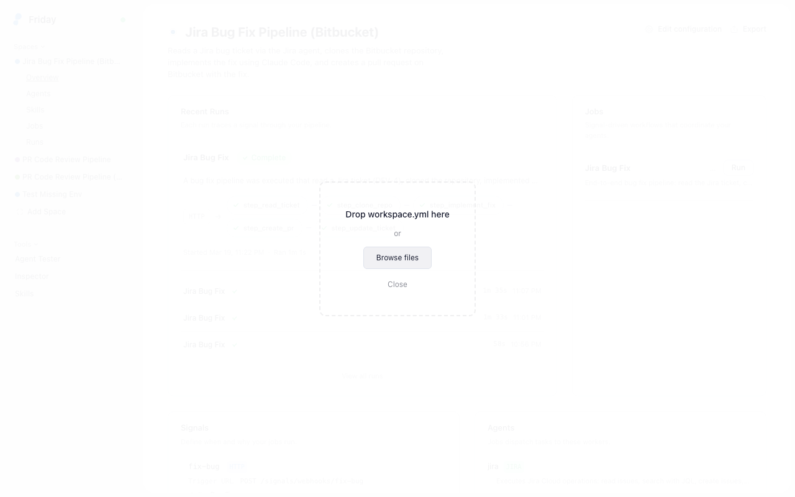
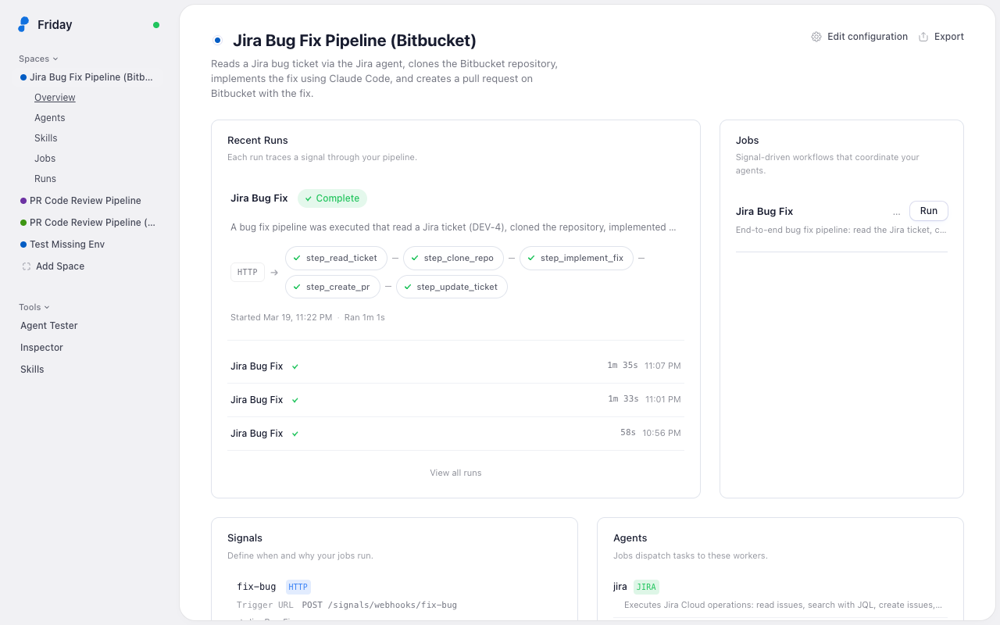
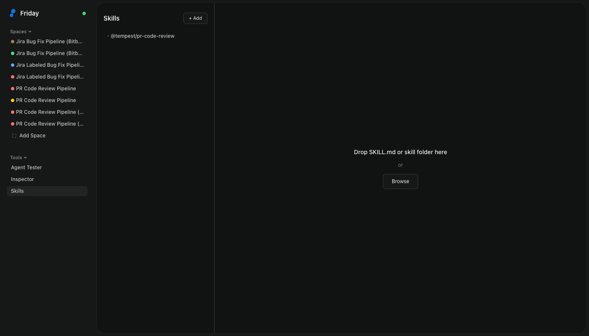
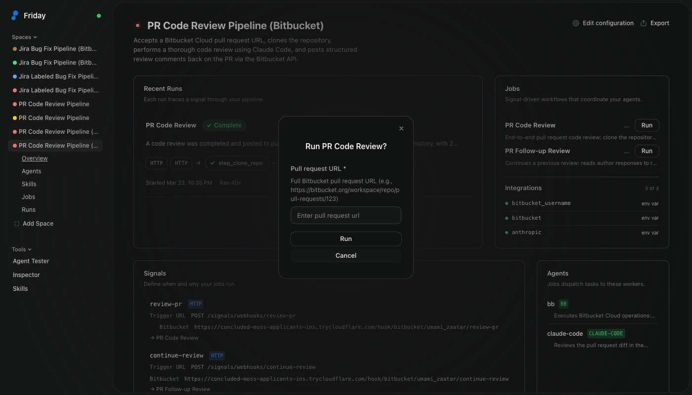
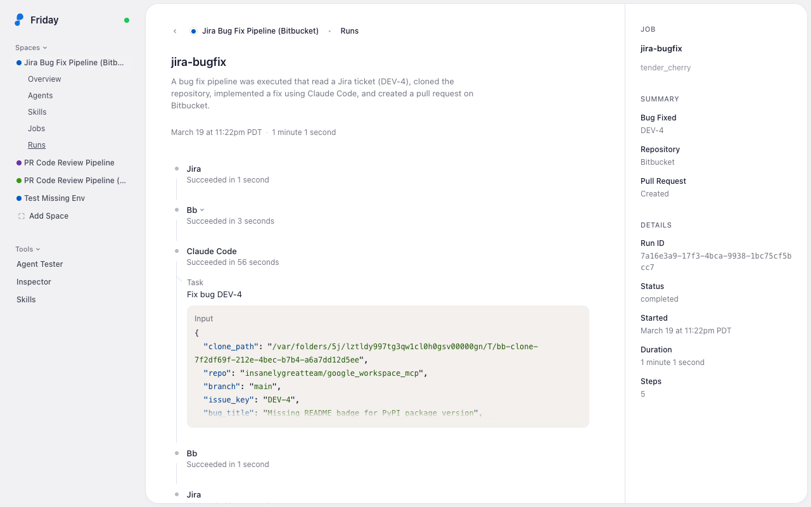
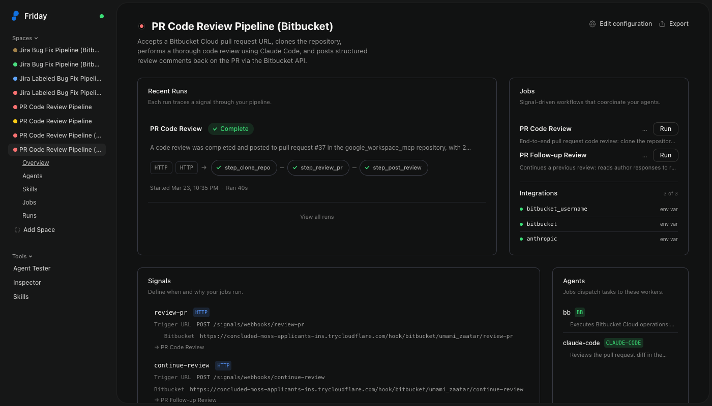

# Friday Developer Platform — Quickstart

Get your Friday distribution running locally with Docker Compose, load a space,
and run your first agentic workflow.

## Overview

The Friday developer platform is a configuration-driven agentic orchestration
runtime. Think of it like Kubernetes, but for agentic workloads. You define
**spaces** composed of three building blocks:

- **Signals** — how external events start your jobs (webhooks, cron, Slack,
  etc.)
- **Agents** — built-in or custom agents that execute operations (Bitbucket,
  Jira, Claude Code, etc.)
- **Jobs** — workflows composed of agents, tools, skills, and data contracts
  that run step by step

Everything is driven by a single `workspace.yml` configuration file. That makes
it versionable, shareable, and repeatable.

## Prerequisites

- [Docker](https://docs.docker.com/get-docker/) with Docker Compose v2+
- An [Anthropic API key](https://console.anthropic.com/) (powers the Claude
  Code agent)
- A [Bitbucket app password](https://support.atlassian.com/bitbucket-cloud/docs/create-an-app-password/)
  with `repository:read`, `repository:write`, and `pullrequest:write`
  permissions
- A [Jira API token](https://id.atlassian.com/manage-profile/security/api-tokens)
  (for the Jira bug fix starter)
- Optionally, a [GitHub personal access token](https://github.com/settings/tokens)
  (for the GitHub PR review starter)

## 1. Create your `.env` file

Create a `.env` file with your API keys:

```bash
# Required for all starters — powers the Claude Code agent
ANTHROPIC_API_KEY=sk-ant-...

# Required for the Bitbucket starters
BITBUCKET_USERNAME=your-username
BITBUCKET_TOKEN=your-app-password

# Required for the Jira bug fix starter
JIRA_SITE=your-site.atlassian.net
JIRA_EMAIL=you@example.com
JIRA_API_TOKEN=your-api-token

# Optional — only needed for the GitHub PR review starter
GH_TOKEN=ghp_...
```

Only set the keys for the starters you plan to run. `ANTHROPIC_API_KEY` is
always required.

## 2. Authenticate with the container registry

The platform image is hosted on Google Artifact Registry. You'll receive a
`key.json` service account key file from Friday — use it to authenticate
Docker:

```bash
docker login -u _json_key --password-stdin https://us-west2-docker.pkg.dev < key.json
```

This only needs to be done once per machine. The credential is stored in your
Docker config and persists across sessions.

## 3. Create `docker-compose.yml`

Create a `docker-compose.yml` in the same directory as your `.env` file:

```yaml
services:
  platform:
    image: us-west2-docker.pkg.dev/friday-platform/releases/platform:latest
    pull_policy: always   # always pull latest; set to "never" for local builds
    platform: linux/amd64  # required on Apple Silicon Macs
    ports:
      - "8080:8080"  # atlasd daemon API
      - "3100:3100"  # link (credential/auth service)
      - "5200:5200"  # agent-playground (web UI)
      - "7681:7681"  # pty-server (WebSocket PTY)
      - "9090:9090"  # webhook-tunnel
    env_file:
      - path: .env
        required: false
    environment:
      ATLAS_LOG_LEVEL: ${ATLAS_LOG_LEVEL:-info}
    volumes:
      - atlas-data:/data/atlas
      - link-data:/data/link
      # Override default webhook mappings (optional — image ships with defaults for examples)
      # - ./webhook-mappings.yml:/app/config/webhook-mappings.yml:ro
    restart: unless-stopped
    healthcheck:
      test:
        - CMD
        - sh
        - -c
        - >
          curl -sf http://localhost:8080/health &&
          curl -sf http://localhost:3100/health &&
          curl -sf http://localhost:7681/health &&
          curl -sf http://localhost:9090/health
      interval: 10s
      timeout: 5s
      start_period: 60s
      retries: 3

volumes:
  atlas-data:
  link-data:
```

> **Using a local build instead of the registry image:** Build with
> `docker build -f Dockerfile-platform -t atlas-platform:local .`, then change
> the `image:` line to `atlas-platform:local` and set `pull_policy: never`.

## 4. Start the platform

```bash
docker compose up
```

Wait for the startup banner:

```
================================================================
  Friday Platform is ready!

  Friday Playground:   http://localhost:5200
  Daemon API:          http://localhost:8080
  Webhook Tunnel:      http://localhost:9090
  Link Service:        http://localhost:3100
  PTY Server:          http://localhost:7681
================================================================
```

Open **http://localhost:5200** in your browser.

## 5. Add a starter space

Your Friday distribution comes with four starter spaces you can try right away.
Each one is a `workspace.yml` that defines a complete agentic workflow — agents,
jobs, signals, and data contracts all in one file.

### Available starters

| Starter | What it does | Required `.env` keys |
| ------- | ------------ | -------------------- |
| [Bitbucket PR Code Review](../examples/pr-review-bitbucket/workspace.yml) | Clones a Bitbucket repo, reviews the PR diff with Claude Code, posts inline comments back on the PR | `ANTHROPIC_API_KEY`, `BITBUCKET_USERNAME`, `BITBUCKET_TOKEN` |
| [Jira Bug Fix](../examples/jira-bugfix-bitbucket/workspace.yml) | Reads a Jira bug ticket, clones the Bitbucket repo, implements the fix with Claude Code, opens a PR, and comments on the Jira ticket with the PR link | `ANTHROPIC_API_KEY`, `BITBUCKET_USERNAME`, `BITBUCKET_TOKEN`, `JIRA_SITE`, `JIRA_EMAIL`, `JIRA_API_TOKEN` |
| [Jira Labeled Bug Fix](../examples/jira-bugfix-labeled/workspace.yml) | Searches a Jira project for tickets labeled `ai-fix`, picks the highest-priority one, claims it, implements the fix, creates a PR, and transitions the ticket to Done | `ANTHROPIC_API_KEY`, `BITBUCKET_USERNAME`, `BITBUCKET_TOKEN`, `JIRA_SITE`, `JIRA_EMAIL`, `JIRA_API_TOKEN` |
| [GitHub PR Code Review](../examples/pr-review/workspace.yml) | Same as the Bitbucket review, but for GitHub PRs | `ANTHROPIC_API_KEY`, `GH_TOKEN` |

### Load via the UI

1. Open **http://localhost:5200** and click **Add Space** in the sidebar
2. **Drag and drop** a `workspace.yml` onto the drop zone, or click
   **Browse files** to select it



3. The space dashboard opens



### Load via the API

You can also load a workspace by posting its parsed YAML config:

```bash
# Parse the YAML and POST it
CONFIG=$(python3 -c "import yaml,json; print(json.dumps(yaml.safe_load(open('pr-review-bitbucket/workspace.yml'))))")
curl -s -X POST http://localhost:8080/api/workspaces/create \
  -H 'Content-Type: application/json' \
  -d "{\"config\":$CONFIG,\"workspaceName\":\"PR Code Review (Bitbucket)\"}"
```

## 6. Publish skills

The PR review starters use the `@tempest/pr-code-review` skill, which must be
published before running those workspaces. Each starter includes a `skill/`
directory with the skill content.

### Publish via the UI

1. Open **http://localhost:5200** and click **Skills** in the sidebar
2. Drag the entire `skill/` folder (containing `SKILL.md` and `references/`)
   onto the drop zone, or click **Browse** to select the folder. Dropping the
   folder ensures the reference files (`references/*.md`) are included in the
   skill archive — dropping just `SKILL.md` alone would publish the
   instructions without the reference materials.
3. The skill appears in the catalog once published



### Publish via the API

```bash
tar czf /tmp/pr-code-review.tar.gz -C pr-review/skill .
curl -X POST http://localhost:8080/api/skills/@tempest/pr-code-review/upload \
  -F "archive=@/tmp/pr-code-review.tar.gz" \
  -F "skillMd=$(cat pr-review/skill/SKILL.md)"
```

The Jira starters don't use skills — skip this step if you're only running
those.

## 7. Trigger a job

Once a space is loaded, start a job by sending a signal.

### Trigger via the UI

Navigate to your space, find the job you want to run, and click **Run**. The
playground prompts you for the required input fields (e.g. a pull request URL
or Jira issue key), then starts the pipeline.



### Trigger via the API

Replace `<workspace-id>` with the ID returned from step 5.

#### Bitbucket PR Review

```bash
curl -X POST http://localhost:8080/api/workspaces/<workspace-id>/signals/review-pr \
  -H 'Content-Type: application/json' \
  -d '{
    "payload": {
      "pr_url": "https://bitbucket.org/workspace/repo/pull-requests/123"
    }
  }'
```

#### Jira Bug Fix (specific ticket)

```bash
curl -X POST http://localhost:8080/api/workspaces/<workspace-id>/signals/fix-bug \
  -H 'Content-Type: application/json' \
  -d '{
    "payload": {
      "issue_key": "PROJ-123",
      "repo_url": "https://bitbucket.org/workspace/repo"
    }
  }'
```

#### Jira Labeled Bug Fix (auto-pick from backlog)

Searches for tickets with the `ai-fix` label in "To Do" status, picks the
highest-priority one, and runs the full fix pipeline.

```bash
curl -X POST http://localhost:8080/api/workspaces/<workspace-id>/signals/process-labeled-bugs \
  -H 'Content-Type: application/json' \
  -d '{
    "payload": {
      "project_key": "PROJ",
      "repo_url": "https://bitbucket.org/workspace/repo"
    }
  }'
```

#### GitHub PR Review

```bash
curl -X POST http://localhost:8080/api/workspaces/<workspace-id>/signals/review-pr \
  -H 'Content-Type: application/json' \
  -d '{
    "payload": {
      "pr_url": "https://github.com/owner/repo/pull/123"
    }
  }'
```

## 8. Watch it run

After triggering a signal:

1. Open the playground at **http://localhost:5200**
2. Navigate to your space
3. You'll see the execution summary — each step of the workflow is called out
   with its status (succeeded, running, failed)
4. Select a session to see real-time progress as each agent step executes



For the Jira bug fix starter, you'll see five steps: the Jira agent reads the
ticket, the Bitbucket agent clones the repo, Claude Code implements the fix,
the Bitbucket agent creates a PR, and the Jira agent comments on the ticket with
the PR link.

## 9. Connect external webhooks

The platform includes a webhook tunnel that creates a public URL via
Cloudflare, so GitHub or Bitbucket can send webhooks directly to your
Friday instance — even when running locally.

The tunnel starts automatically. Navigate to any space in the playground — each HTTP
signal shows the full webhook URL for your configured providers (GitHub,
Bitbucket, Jira).



### Register the webhook

1. Navigate to your space in the playground
2. Find the signal you want to trigger (e.g. `review-pr`)
3. Copy the webhook URL shown under the signal (e.g.
   `https://...trycloudflare.com/hook/bitbucket/<workspace-id>/review-pr`)
4. In your repo or project settings, add a webhook:

   **GitHub:**
   - **URL**: paste the webhook URL
   - **Content type**: select **`application/json`** (required — the default
     `application/x-www-form-urlencoded` will not work)
   - **Secret**: paste the secret
   - **Events**: select "Pull requests"

   **Bitbucket:**
   - **URL**: paste the webhook URL
   - **Secret**: paste the secret
   - **Events**: select "Pull Request — Created" (and optionally "Updated")
   - Content type is always `application/json` — no selector needed

   **Jira:**
   - **URL**: paste the webhook URL
   - **Secret**: paste the secret (Jira signs payloads with HMAC via the
     `X-Hub-Signature` header)
   - **Events**: select the relevant issue events (e.g. "Issue — updated")
   - Content type is always `application/json` — no selector needed

Now when a PR is opened in your repo, the webhook fires → tunnel receives it
→ transforms the payload → triggers the signal → your pipeline runs.

### Webhook URL format

```
https://{tunnel-domain}/hook/{provider}/{workspaceId}/{signalId}
```

The `{provider}` determines how the webhook payload is transformed:
- `github` — extracts `pr_url` from GitHub PR events
- `bitbucket` — extracts `pr_url` from Bitbucket PR events
- `jira` — extracts `issue_key`, `project_key` from Jira issue events
- `raw` — forwards the payload as-is (no transformation)

### Webhook mappings

The webhook tunnel uses a `webhook-mappings.yml` file to decide which events to
accept and how to extract signal payload fields from incoming webhook bodies. The
image ships with defaults that cover the starter spaces:

```yaml
providers:
  github:
    event_header: x-github-event
    signature_header: x-hub-signature-256

    events:
      pull_request:
        actions: [opened, reopened, synchronize]
        mapping:
          pr_url: "pull_request.html_url"

      issues:
        actions: [opened, labeled]
        mapping:
          issue_url: "issue.html_url"
          issue_key: "issue.number"
          title: "issue.title"
          action: "action"

      push:
        mapping:
          ref: "ref"
          repo: "repository.full_name"
          sha: "after"
          pusher: "pusher.name"

  bitbucket:
    event_header: x-event-key
    signature_header: x-hub-signature

    events:
      "pullrequest:created":
        mapping:
          pr_url: "pullrequest.links.html.href"

      "pullrequest:updated":
        mapping:
          pr_url: "pullrequest.links.html.href"

      "repo:push":
        mapping:
          repo: "repository.full_name"
          branch: "push.changes[0].new.name"
          sha: "push.changes[0].new.target.hash"

  jira:
    # Jira sends event type in the body (webhookEvent field), not a header
    event_field: webhookEvent
    signature_header: x-hub-signature

    events:
      "jira:issue_created":
        mapping:
          issue_key: "issue.key"
          project_key: "issue.fields.project.key"
          summary: "issue.fields.summary"
          repo_url: "issue.fields.customfield_10000"

      "jira:issue_updated":
        mapping:
          issue_key: "issue.key"
          project_key: "issue.fields.project.key"
          summary: "issue.fields.summary"
          repo_url: "issue.fields.customfield_10000"
```

Each provider entry defines:
- **`event_header`** or **`event_field`** — where to find the event type
  (HTTP header for GitHub/Bitbucket, body field for Jira)
- **`signature_header`** — header used for HMAC-SHA256 verification
- **`events`** — map of event names to an optional `actions` filter and a
  `mapping` of output field → dot-path into the webhook body

To customize, save your own `webhook-mappings.yml` and uncomment the volume
mount in `docker-compose.yml`:

```yaml
volumes:
  - ./webhook-mappings.yml:/app/config/webhook-mappings.yml:ro
```

## Stopping the platform

```bash
docker compose down
```

Data persists across restarts in Docker volumes. To start fresh:

```bash
docker compose down -v
```

## Troubleshooting

**Container fails to start:** Check that Docker has at least 4 GB of memory
allocated. Also make sure ports 8080, 3100, 5200, 7681, and 9090 are free — if
another service is already bound to one of them, Docker will fail with an
"address already in use" error.

**"no matching manifest for linux/arm64":** The image is built for `amd64`. On
Apple Silicon Macs, Docker Desktop runs it via Rosetta emulation. Make sure
`platform: linux/amd64` is in your `docker-compose.yml` (included in the
example above).

**`ANTHROPIC_API_KEY` errors:** Verify your key is set in `.env` and the
container was restarted after adding it (`docker compose down && docker compose up`).

**Bitbucket/Jira/GitHub auth failures:** Make sure the corresponding tokens in
`.env` have the right permissions:
- **Bitbucket:** App password with `repository:read`, `repository:write`, and
  `pullrequest:write`
- **Jira:** `JIRA_API_TOKEN` from https://id.atlassian.com/manage-profile/security/api-tokens,
  `JIRA_SITE` is just the hostname (e.g. `acme.atlassian.net`)
- **GitHub:** `repo` scope for private repos, or just public repo access

**Logs:** View service logs with:

```bash
docker compose logs -f
```
