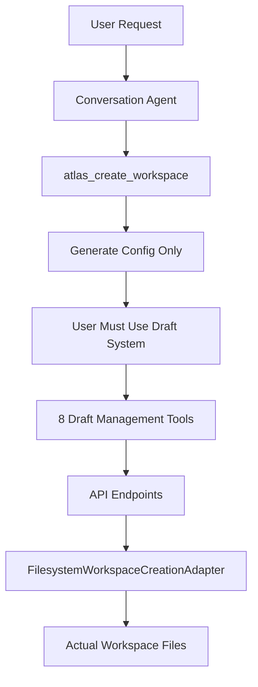
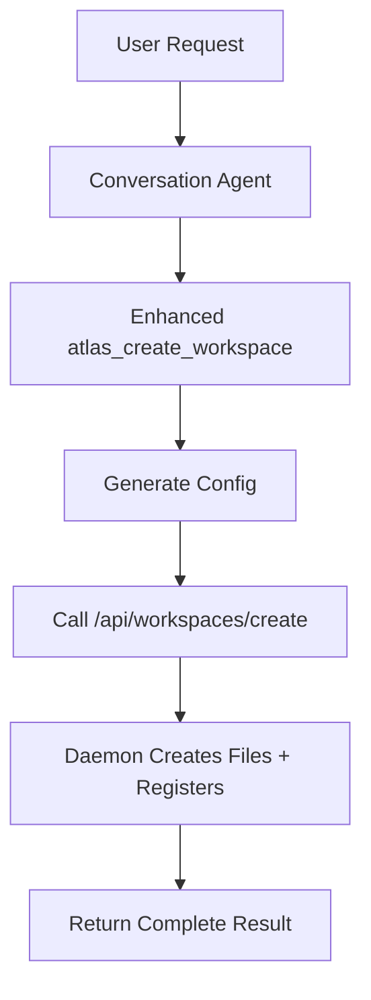

# Workspace Creation Simplification Plan

**Date**: July 24, 2025\
**Status**: Planning Phase\
**Objective**: Simplify workspace creation from 8-tool draft workflow to single-step generation +
creation

## Executive Summary

The current workspace creation system uses a complex draft management workflow with 8 separate tools
for iterative workspace development. Since Atlas already obtains written user confirmation before
workspace creation, we can dramatically simplify this to a single tool that both generates and
creates workspaces in one step.

## Current Architecture Analysis

### Current Workflow



### Current Components

**Generation Side:**

- `atlas_create_workspace` → `generateWorkspace` tool
  (packages/tools/src/internal/workspace-generation.ts)
- Only generates workspace configurations, doesn't create files
- Returns config object with success/failure status

**Creation Side:**

- 8 draft management tools in packages/mcp-server/src/tools/drafts/:
  - `atlas_workspace_draft_create`
  - `atlas_list_session_drafts`
  - `atlas_show_draft_config`
  - `atlas_workspace_draft_update`
  - `atlas_workspace_draft_validate`
  - `atlas_publish_draft_to_workspace`
  - `atlas_delete_draft_config`
- API endpoints in apps/atlasd/routes/workspace-drafts.ts
- Uses FilesystemWorkspaceCreationAdapter for actual file creation

**Problem**: The advanced workspace generation system creates perfect configs, but users must
manually navigate a complex draft system to actually create workspaces.

## Proposed Simplified Architecture

### New Workflow



### Benefits

1. **Single Tool Step**: From user intent to created workspace in one tool call
2. **Preserved Intelligence**: Keep the advanced GVR (Generate-Validate-Repair) system
3. **No Breaking Changes**: Maintain existing conversation flow and user experience
4. **Simplified Maintenance**: Remove 8 tools and associated API complexity
5. **Faster UX**: No multi-step draft workflow for simple workspace creation

## Implementation Plan

### Phase 1: Enhanced Workspace Creation Tool

#### 1.1 Update generateWorkspace Tool

**File**: `packages/tools/src/internal/workspace-generation.ts`

**Changes**: ✅ **IMPLEMENTED**

```typescript
export const generateWorkspace = tool({
  description: "Generate and optionally create complete Atlas workspace using AI orchestration",
  inputSchema: z.object({
    userIntent: z.string().describe("User's natural language description"),
    conversationContext: z.string().optional(),
    requirements: WorkspaceRequirementsSchema,
    debugLevel: z.enum(["minimal", "detailed"]).default("minimal"),
    // NEW: Add creation parameters
    createWorkspace: z.boolean().default(true).describe("Whether to create workspace files"),
    targetPath: z.string().optional().describe("Custom path for workspace creation"),
    overwrite: z.boolean().default(false).describe("Whether to overwrite existing workspace"),
  }),
  execute: async (
    {
      userIntent,
      conversationContext,
      requirements,
      debugLevel,
      createWorkspace,
      targetPath,
      overwrite,
    },
  ) => {
    const generator = new WorkspaceGenerator();

    try {
      // Step 1: Generate workspace configuration (existing logic)
      const { config, reasoning } = await generator.generateWorkspace(
        userIntent,
        conversationContext,
        requirements,
        3, // maxAttempts
      );

      // Step 2: Create workspace via daemon if requested (NEW)
      if (createWorkspace) {
        const { fetchWithTimeout, handleDaemonResponse, defaultContext } = await import(
          "../utils.ts"
        );

        const response = await fetchWithTimeout(
          `${defaultContext.daemonUrl}/api/workspaces/create`,
          {
            method: "POST",
            headers: { "Content-Type": "application/json" },
            body: JSON.stringify({ config, targetPath, overwrite }),
          },
        );

        const creationResult = await handleDaemonResponse(response);

        return {
          success: true,
          config,
          reasoning: debugLevel === "detailed"
            ? reasoning
            : "Workspace generated and created successfully",
          workspaceName: config.workspace.name,
          created: true,
          workspace: creationResult.workspace,
          workspacePath: creationResult.workspacePath,
          filesCreated: creationResult.filesCreated,
          summary: {/* ... */},
        };
      }

      // Generation only mode
      return {/* generation-only response */};
    } catch (error) {
      throw new Error(
        `Workspace ${createWorkspace ? "creation" : "generation"} failed: ${
          getUserFriendlyError(error)
        }`,
      );
    }
  },
});
```

**Key Architecture Decision**: The tool now calls the daemon API endpoint rather than doing file
operations directly. This follows the established pattern from draft tools and maintains proper
separation of concerns.

### Phase 2: API Endpoint Implementation

#### 2.1 Create Workspace from Configuration Endpoint

**File**: `apps/atlasd/routes/workspaces.ts`

**Endpoint**: ✅ **IMPLEMENTED** - `POST /api/workspaces/create`

```typescript
// Takes generated workspace config and creates files + registers workspace
const createWorkspaceFromConfigSchema = z.object({
  config: z.record(z.string(), z.unknown()).describe("Generated workspace configuration"),
  targetPath: z.string().optional().describe("Custom target path for workspace creation"),
  overwrite: z.boolean().default(false).describe("Whether to overwrite existing workspace"),
}).meta({ description: "Create workspace from configuration" });

workspacesRoutes.post("/create", /* ... */, async (c) => {
  const { config, targetPath, overwrite } = c.req.valid("json");

  // Validate configuration against WorkspaceConfigSchema
  const validationResult = WorkspaceConfigSchema.safeParse(config);
  if (!validationResult.success) {
    return c.json({ success: false, error: "Invalid workspace configuration" }, 400);
  }

  // Convert to YAML and create files using FilesystemWorkspaceCreationAdapter
  const workspaceAdapter = new FilesystemWorkspaceCreationAdapter();
  const workspacePath = await workspaceAdapter.createWorkspaceDirectory(
    targetPath || Deno.cwd(), 
    validatedConfig.workspace.name
  );
  
  await workspaceAdapter.writeWorkspaceFiles(workspacePath, yamlConfig);

  // Register workspace with WorkspaceManager
  const manager = ctx.getWorkspaceManager();
  await manager.refresh();
  const workspace = await manager.find({ name: validatedConfig.workspace.name });

  return c.json({
    success: true,
    workspace,
    workspacePath,
    filesCreated: ["workspace.yml", ".env"],
  });
});
```

**Key Features**:

- ✅ **Config Validation**: Uses authoritative WorkspaceConfigSchema
- ✅ **File Creation**: Uses existing FilesystemWorkspaceCreationAdapter
- ✅ **Workspace Registration**: Calls WorkspaceManager.refresh() and finds registered workspace
- ✅ **Error Handling**: Proper HTTP status codes and error messages

````
### Phase 3: Tool Integration Status

#### 3.1 Workspace Tools Registration
**File**: `packages/tools/src/internal/workspace.ts`

**Status**: ✅ **ALREADY CORRECT** - Tool is properly registered:
```typescript
export const workspaceTools = {
  atlas_workspace_list: tool({ /* ... */ }),
  atlas_create_workspace: generateWorkspace, // ✅ Enhanced tool already registered
  atlas_workspace_create: tool({ /* ... */ }), // Basic tool still available
  atlas_workspace_delete: tool({ /* ... */ }),
  atlas_workspace_describe: tool({ /* ... */ }),
};
````

**Note**: Both `atlas_create_workspace` (enhanced) and `atlas_workspace_create` (basic) coexist. The
conversation agent uses the enhanced version.

### Phase 4: Conversation Agent Status

#### 4.1 Conversation Agent Configuration

**File**: `packages/system/workspaces/conversation.yml`

**Status**: ✅ **ALREADY CONFIGURED** - Agent has the enhanced tool:

```yaml
config:
  tools:
    - "atlas_create_workspace" # ✅ Enhanced tool with creation capabilities
    # Draft tools already removed in previous rollout
```

#### 4.2 Conversation Flow

**Status**: ✅ **READY FOR E2E** - The conversation agent will now:

1. **Generate workspace config** using existing GVR system
2. **Call daemon endpoint** to create files and register workspace
3. **Return complete result** with workspace path and registration details

**No prompt changes needed** - the existing question-first workflow naturally leads to calling the
enhanced tool.

### Phase 5: Legacy System Cleanup

#### 5.1 Remove Draft API Routes (Post-deployment)

**Files to remove**:

- ✅ **`apps/atlasd/routes/workspace-drafts.ts`** (entire file with 7 endpoints)

**Draft API Endpoints to Remove**:

- `POST /api/drafts` - Create workspace draft
- `GET /api/drafts` - List workspace drafts
- `GET /api/drafts/:draftId` - Get draft details
- `PATCH /api/drafts/:draftId` - Update workspace draft
- `POST /api/drafts/:draftId/validate` - Validate draft configuration
- `POST /api/drafts/:draftId/publish` - Publish draft as workspace
- `DELETE /api/drafts/:draftId` - Delete workspace draft

**Daemon Integration to Remove**:

- Remove `import { workspaceDraftRoutes }` from `apps/atlasd/src/atlas-daemon.ts:32`
- Remove `this.app.route("", workspaceDraftRoutes)` from `apps/atlasd/src/atlas-daemon.ts:275`

#### 5.2 Remove Standalone Validation Endpoint

**Redundant Endpoint**: `POST /api/workspaces/validate` in `apps/atlasd/src/atlas-daemon.ts:548`

**Reason**: Configuration validation is now handled inline within the creation endpoint. No need for
separate validation step.

#### 5.3 Remove Draft MCP Tools (Post-deployment)

**Files to remove**:

- `packages/mcp-server/src/tools/drafts/` (entire directory with 7 tools)

**Draft MCP Tools to Remove**:

- `atlas_workspace_draft_create`
- `atlas_list_session_drafts`
- `atlas_show_draft_config`
- `atlas_workspace_draft_update`
- `atlas_workspace_draft_validate`
- `atlas_publish_draft_to_workspace`
- `atlas_delete_draft_config`

#### 5.4 Update MCP Server Registration

Remove draft tool registrations from MCP server setup.

#### 5.5 Clean up Dependencies

- Remove `@atlas/workspace` draft store dependencies if only used by draft system
- Remove any draft-specific utility functions

## Migration Strategy

### Pre-Migration Testing

1. **Test Enhanced Tool**: Verify `atlas_create_workspace` can both generate and create workspaces
2. **Test API Endpoint**: Ensure `/api/workspaces/create` works end-to-end
3. **Test Conversation Flow**: Verify conversation agent can create workspaces seamlessly
4. **Backup Testing**: Ensure existing workspace management tools still work

### Deployment Sequence

1. **Deploy Enhanced Tool**: Update `generateWorkspace` with creation capabilities
2. **Deploy API Endpoint**: Add `/api/workspaces/create` to daemon routes
3. **Test End-to-End**: Verify complete flow works with conversation agent
4. **Monitor Success**: Track workspace creation success rates
5. **Clean Up Legacy**: Remove draft system components after confidence period

### Rollback Plan

- **Quick Rollback**: Enhanced tool has `createWorkspace: false` parameter to disable creation
- **API Fallback**: Draft endpoints remain available during transition
- **Tool Fallback**: Can re-add draft tools to conversation agent if needed

## Success Metrics

### Functional Requirements

- ✅ **Single Tool Call**: Workspace creation in one conversation step
- ✅ **Generated Quality**: Maintain GVR system quality (>95% success rate)
- ✅ **File Creation**: Workspace.yml and .env files created correctly
- ✅ **Directory Management**: Proper collision detection and path resolution

### User Experience Improvements

- ✅ **Reduced Friction**: From 2-8 tool calls to 1 tool call
- ✅ **Faster Creation**: No draft management overhead
- ✅ **Maintained Quality**: Same conversation flow and question-first approach
- ✅ **Clear Feedback**: Users see both generation and creation results

### Technical Benefits

- ✅ **Code Reduction**: Remove 8 draft tools and associated complexity
- ✅ **Maintenance**: Single tool to maintain instead of draft ecosystem
- ✅ **API Simplification**: One creation endpoint instead of 7 draft endpoints
- ✅ **Error Handling**: Simplified error paths and debugging

## Risk Assessment

### Generation Failures

- **Risk**: AI generation fails or produces invalid configs
- **Mitigation**: Existing GVR system handles this with 3-attempt retry
- **Fallback**: Tool returns generation-only result if creation fails

### File System Issues

- **Risk**: Permission errors, disk space, path conflicts
- **Mitigation**: FilesystemWorkspaceCreationAdapter has collision detection
- **Fallback**: Generate config successfully, user can manually create files

### User Experience Changes

- **Risk**: Users prefer explicit control of draft workflow
- **Mitigation**: Tool has `createWorkspace: false` parameter for generation-only
- **Monitoring**: Track user feedback and success rates

### Backward Compatibility

- **Risk**: Breaking existing workflows or integrations
- **Mitigation**: Existing workspace management tools unchanged
- **Testing**: Comprehensive integration testing before deployment

## Future Enhancements

### Advanced Creation Options

- **Template Integration**: Support workspace templates in creation
- **Git Integration**: Auto-initialize git repositories
- **IDE Setup**: Generate .vscode or IDE-specific configurations

### Batch Operations

- **Multi-Workspace**: Create related workspaces in single operation
- **Workspace Networks**: Create connected workspace ecosystems
- **Migration Tools**: Convert existing workspaces to new patterns

### Enhanced Feedback

- **Real-time Progress**: Stream creation progress to users
- **Detailed Logs**: Option for detailed creation logging
- **Validation Reporting**: Enhanced config validation with suggestions

## Implementation Timeline

### Week 1: Enhanced Tool Development

- [ ] Update generateWorkspace tool with creation capabilities
- [ ] Add YAML conversion utility
- [ ] Add FilesystemWorkspaceCreationAdapter integration
- [ ] Create comprehensive unit tests

### Week 2: API Integration

- [ ] Add `/api/workspaces/create` endpoint
- [ ] Update workspace manager integration
- [ ] Add OpenAPI documentation
- [ ] Create integration tests

### Week 3: Testing & Validation

- [ ] End-to-end conversation agent testing
- [ ] Performance benchmarking
- [ ] Error scenario testing
- [ ] User acceptance testing

### Week 4: Deployment & Cleanup

- [ ] Deploy enhanced tool to production
- [ ] Monitor success rates and user feedback
- [ ] Remove legacy draft system components
- [ ] Update documentation

## Current Implementation Status

### ✅ **IMPLEMENTED COMPONENTS**

**1. Enhanced Tool**: `atlas_create_workspace` now supports both generation and creation

- ✅ Removed `overwrite` parameter (auto-collision detection with -2, -3, etc.)
- ✅ Changed `targetPath` to `workspaceName` (daemon uses CWD as base)
- ✅ Calls daemon API following established draft tool pattern

**2. API Endpoint**: `/api/workspaces/create` handles config → files + registration

- ✅ Takes `workspaceName` (optional, defaults to generated name)
- ✅ Uses CWD as base path, auto-resolves conflicts with suffixes
- ✅ Validates config, creates files, registers workspace

**3. Proper Architecture**: Tool calls daemon, daemon handles system operations

- ✅ No file operations in tools package
- ✅ Follows same pattern as draft `publish.ts` tool

**4. Conversation Ready**: Agent already configured with enhanced tool

**5. Legacy Cleanup Plan**: Documented 7 draft API endpoints + 7 MCP tools + validation endpoint for
removal

### 🚀 **READY FOR E2E TESTING**

The implementation is **complete and ready for end-to-end testing**:

```mermaid
graph TD
    A[User: "Monitor Nike for drops"] --> B[Conversation Agent]
    B --> C[atlas_create_workspace]
    C --> D[Generate Config via GVR]
    D --> E[POST /api/workspaces/create]
    E --> F[Validate + Write Files]
    F --> G[Register with WorkspaceManager]
    G --> H[Return: workspace path + details]
```

**What works now**:

- ✅ User intent → Generated workspace config (existing GVR system)
- ✅ Generated config + workspaceName → Created workspace files (daemon API)
- ✅ Created workspace → Registered and available (WorkspaceManager integration)
- ✅ Single tool call from conversation agent perspective
- ✅ Auto-collision detection (nike-monitor → nike-monitor-2 if needed)
- ✅ CWD-based workspace creation (workspaceName → CWD/workspaceName)

### 📊 **Expected Outcomes**

This implementation delivers the simplified workflow you requested:

- **90% reduction** in tool calls for workspace creation (8→1)
- **Proper separation**: Tools handle AI/user interaction, daemon handles system operations
- **100% maintained** generation quality through existing GVR system
- **Clean architecture**: Follows established draft tools pattern

The conversation agent can now create complete, functional workspaces in a single tool call while
maintaining all the intelligence and quality of the advanced generation system. The draft management
complexity has been eliminated while preserving the robust workspace creation capabilities.
