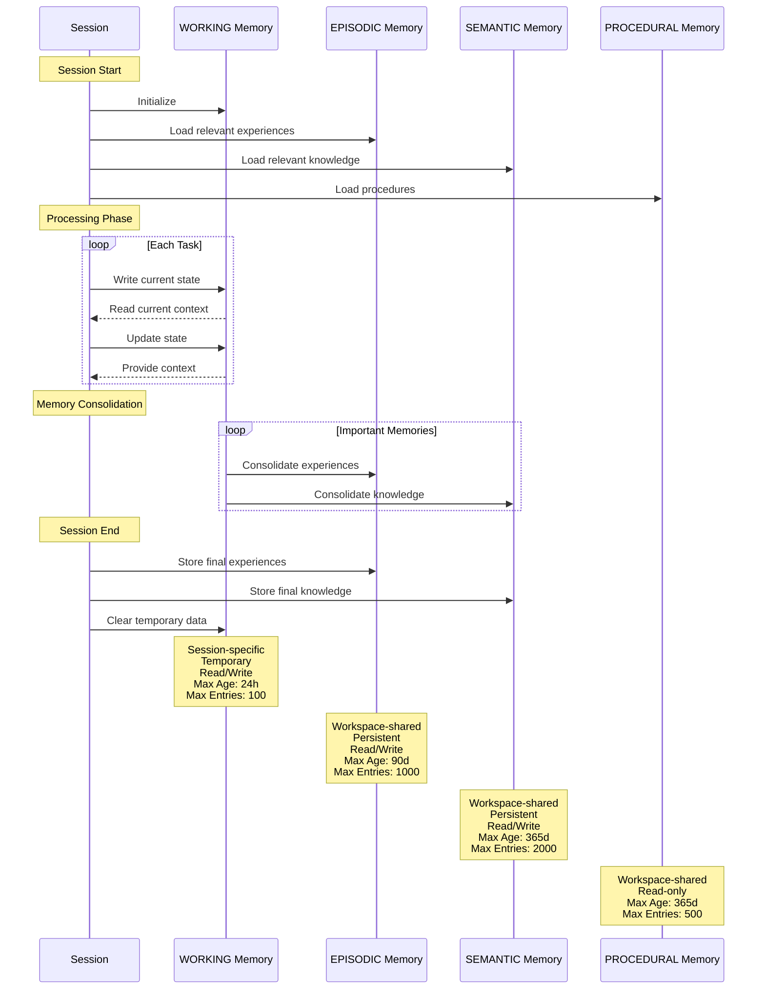

# Memory Model Flow Documentation

## Memory Types

1. **WORKING Memory**
   - Short-term, active processing of current session
   - Session-specific and temporary
   - Read/Write access
   - Max Age: 24 hours
   - Max Entries: 100

2. **EPISODIC Memory**
   - Specific experiences and events
   - Workspace-shared and persistent
   - Read/Write access
   - Max Age: 90 days
   - Max Entries: 1000

3. **SEMANTIC Memory**
   - General knowledge and concepts
   - Workspace-shared and persistent
   - Read/Write access
   - Max Age: 365 days
   - Max Entries: 2000

4. **PROCEDURAL Memory**
   - How-to knowledge and skills
   - Workspace-shared and read-only
   - Read-only access
   - Max Age: 365 days
   - Max Entries: 500

## Memory Operations

1. **Read Operation**
   - Occurs at session start
   - Loads relevant context from all memory types
   - Used to inform current session processing

2. **Write Operation**
   - Occurs during session processing
   - Primarily writes to WORKING memory
   - At session end, writes to EPISODIC and SEMANTIC memory

3. **Consolidation**
   - Moves important WORKING memories to long-term storage
   - Based on access count (>3) or relevance score (>0.8)
   - Converts to EPISODIC or SEMANTIC memory

## Session Flow

1. **Session Start**
   - Loads memory context from all memory types
   - Prepares working memory for current session

2. **Processing**
   - Uses working memory for active processing
   - May read from other memory types as needed

3. **Memory Storage**
   - Stores session learnings in appropriate memory types
   - Consolidates important working memories

4. **Session End**
   - Finalizes memory storage
   - Prepares for next session
